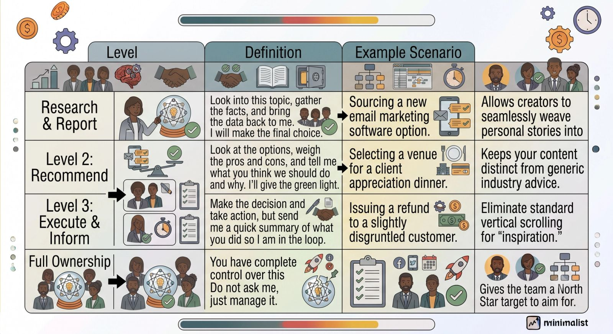
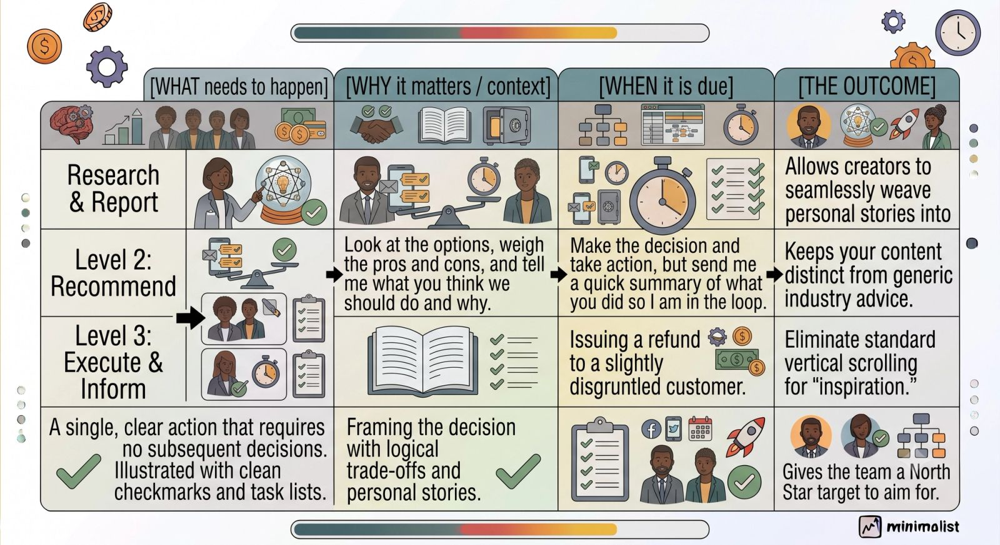

Every ambitious founder reaches a point where their business stops being an exciting venture and starts feeling like an operational prison. You are working 60-hour weeks, your inbox is a runaway train, and your brain constantly feels like it has 47 browser tabs open at the same time.

You know you need to delegate. But every time you try, the task comes back broken, late, or done so poorly that you think, *"It would just be faster if I did it myself."*

This is the classic founder's trap. The bottleneck isn't your team's capability; it’s your delegation framework. If you want to scale your business and reclaim your strategic thinking time, you need to upgrade how you hand off work.

Here are three delegation hacks you can implement today to instantly clear your mental dashboard.

### Hack 1: The "Level of Authority" Matrix

Miscommunication happens when a team member doesn't know how much power they have to make a choice. They either micromanage you by asking permission for every tiny detail, or they make a massive, unauthorized decision that blows up in your face.

To fix this, assign one of the **Four Levels of Authority** to every major project you hand off:

> **Founder Tip:** Labeling your tasks with these levels eliminates second-guessing. A simple text like, *"Hey Alex, look into the new bookkeeping software options. This is a Level 2 assignment,"* saves hours of back-and-forth alignment.

### Hack 2: Define the "Definition of Done" (DoD)

When you tell an assistant to *"clean up our customer spreadsheet,"* you have a specific visual image of what that looks like. Your assistant has a completely different one. When they turn in a half-baked sheet, you get frustrated.

To bypass this entirely, never delegate a task without explicitly outlining its **Definition of Done**.

Before hitting send on a task assignment, answer these three criteria:

- **The Format:** What form must the final asset take? (e.g., A shared Google Sheet sorted alphabetically).
- **The Constraints:** What are the strict boundaries? (e.g., Only active clients from the past 12 months, capped at 100 entries max).
- **The Location:** Where does the finished asset live? (e.g., linked inside the description of Asana task #402).

By spending an extra 60 seconds outlining the exact finish line, you eliminate the exhausting loop of revisions.

### Hack 3: The "What / Why / When" Audio Drop

Writing out long, perfectly formatted task instructions takes time—time you often don't have when you're busy running a company. Because writing is tedious, founders often drop vague text messages like, *"Hey, can you update the website header?"* This lack of context guarantees a flawed result.

The hack? Switch entirely to async voice notes or quick videos (using Slack clips, Loom, or Voxer) utilizing the **What / Why / When** framework:

- **What:** *"I need you to swap out the main hero image on the homepage."*
- **Why (The missing link):** *"We are launching a summer promo, so the old winter jacket photo looks totally out of date and is hurting our conversion rate."* (Giving the *why* empowers your team member to fix related issues, like updating the subtext or buttons, without you asking).
- **When:** *"This needs to be live by Thursday at 9:00 AM EST before our email blast goes out."*

### The Bottom Line

True delegation isn’t about dumping tasks off your plate and hoping for the best; it’s about giving your remote staff the guardrails, context, and boundaries they need to succeed independently.

Start applying these three frameworks this week. By bringing absolute clarity to your expectations, you'll watch your team’s execution skyrocket while you finally get the breathing room to focus on high-level growth.
