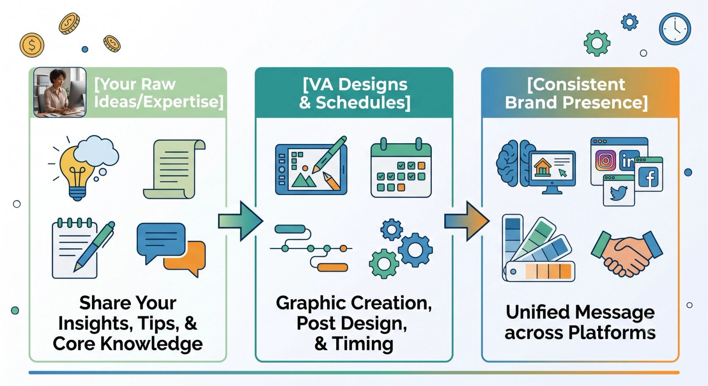
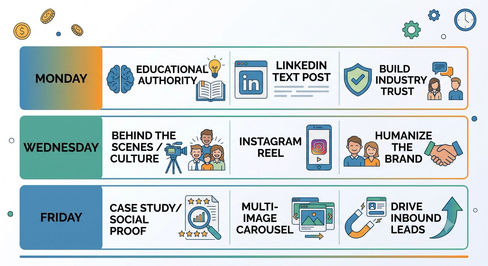

We all know the story. You start the month with the best intentions, determined to post engaging, high-quality content every single day. But then reality hits. Clients call, deadlines loom, operations bottleneck, and suddenly your social media channels go dark for three weeks.

In the digital world, **consistency is currency**. The algorithms reward it, and your audience expects it. But as a business leader, you shouldn't be spending your Sunday nights wrestling with Canva or stressing over the perfect Instagram caption.

That is exactly why smart brands partner with a **Social Media Virtual Assistant (VA)**. Here are three powerful ways a social media VA takes the chaos out of content creation and keeps your pipeline full.

## The Social Media Consistency Formula

A successful social media strategy isn't built on random bursts of inspiration; it’s built on a reliable system. A specialized VA turns your raw ideas into a smooth, repeatable production line.

## 1. Transforming Raw Ideas into Multi-Platform Assets

You are the subject matter expert, but you don't need to be a graphic designer or video editor. A social media VA excels at content repurposing—taking one piece of core content and breaking it down into multiple platform-specific assets.

- **The Workflow:** You record a quick 5-minute Loom video or voice memo sharing an industry insight.
- **The VA’s Magic:** They turn that single video into a text post for LinkedIn, a stylized carousel for Instagram, and a short-form video clip for TikTok.
- **The Result:** You show up everywhere without having to create unique content for every individual platform.

## 2. Managing the Batching and Scheduling Pipeline

The biggest enemy of consistency is posting on the fly. When you post in real-time, you are vulnerable to daily distractions. A social media VA shifts your strategy from reactive to proactive through **batch processing**.

### The Content Calendar Blueprint

Your VA sets up a centralized social media calendar using tools like Notion, Trello, or Asana. They organize your topics into predictable weekly content pillars:

Once you approve the monthly layout, your VA uploads and schedules everything using publishing tools like Buffer, Hootsuite, or Later. Your content goes live exactly on time, whether you are in a boardroom meeting or on a flight.

## 3. Handling Active Engagement and Community Growth

Posting content is only half the battle; social media is a two-way street. If your audience comments on your posts and hears nothing but crickets, your engagement rates will plummet.

A social media VA steps in to manage the community management dashboard:

- **The First 30 Minutes:** They monitor your posts immediately after publishing to reply to early comments, signaling to the algorithm that your post is generating active conversation.
- **Inbound Triaging:** They clean up your DMs, filtering spam and answering basic FAQs, while flagging high-value sales inquiries directly for you.
- **Proactive Outreach:** They spend time interacting with target accounts, industry hashtags, and complementary brands to naturally increase your account's visibility.

> **The ROI of a Social Media VA:** If you spend 5 hours a week writing captions, resizing images, and finding hashtags, that is 20 hours a month stolen from your core zone of genius. Delegating this to a VA doesn't just save your sanity—it builds a reliable brand asset that works for you 24/7.

## Ready to Break the Post-and-Ghost Cycle?

Stop letting your digital footprint be an afterthought. By bringing on a specialized social media virtual assistant, you can step out of the daily production weeds and step into your role as the visionary voice of your business.
