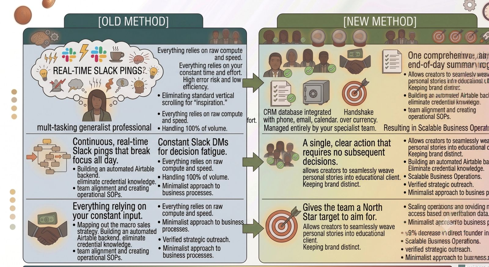
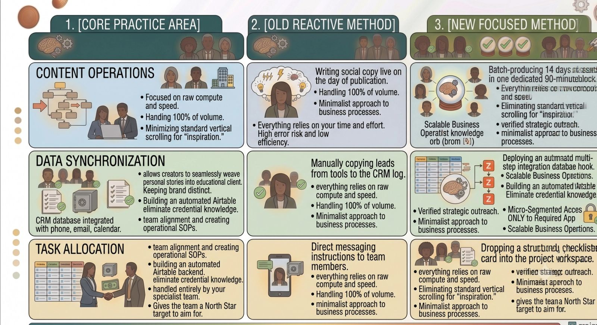

Sixty days ago, my virtual assistant practice was running on pure adrenaline and chaos.

On paper, things looked great. I was securing client contracts, delivering high-quality assets, and staying busy from dawn until dusk. But behind the scenes, I was falling into the same operational trap that traps the scaling founders I support.

I was drowning in shallow work. My days were entirely fractured by constant Slack pings, endless context-switching, and reactive problem-solving. I was spending so much time *managing the noise* of the business that I had zero space left to optimize our actual core systems.

So, I drew a line in the sand. I committed to a strict **60-Day Focus Challenge**: an intentional operational sprint designed to eliminate non-essential tasks, harden our internal documentation, and transition my practice from a reactive service into a highly leveraged machine.

Now that the sprint is complete, here is an open look at the data, the structural changes made, and the major lessons learned along the way.

### The Diagnostics: Mapping the Time Leaks

To kick off the challenge, I spent the first week ruthlessly tracking every single minute of my working hours. The data was eye-opening. I discovered that nearly 40% of my weekly capacity was being devoured by three specific structural leaks:

1. **The WhatsApp/Slack Echo Chamber:** Answering client check-ins that could have easily been handled asynchronously via a single daily summary log.
2. **The "SOP Debt":** Manually rebuilding template structures for recurring tasks because we hadn't taken 10 minutes to properly document the workflow the first time.
3. **The Multi-Tasking Penalty:** Constantly jumping between client lead generation spreadsheets, content scheduling tools, and my personal inbox every 15 minutes.

I realized that to scale my delivery, I had to stop acting like a chaotic firefighter and start acting like a systems engineer.

### The Three Operational Pivots That Changed Everything

During the 60-day challenge, I implemented three non-negotiable structural boundaries across my entire book of business:

#### I. Consolidating the Communication Matrix

I explicitly moved all client accounts away from real-time instant messaging pipelines. Instead, we shifted entirely to a unified asynchronous workflow framework.

By guaranteeing clients a deeply thorough update at the end of every business afternoon, I eliminated the urgent back-and-forth friction during the day. This single boundary instantly bought me four unbroken hours of deep-focus time every single morning.

#### II. Hardening Our Internal SOP Engine

We initiated a strict policy: *If a complex workflow is executed more than twice, it must have a permanent, visual blueprint.* Every time my team or I completed a recurring task, we dropped a brief screen-share video recording into our centralized master directory.

#### III. The Power of Single-Tasking Time Blocks

I completely restructured my calendar. Instead of pepper-spraying administrative tasks throughout the day, I initiated themed focus blocks. Mondays and Wednesdays became dedicated entirely to deep client execution; Tuesdays and Thursdays were locked for business building and system development; Fridays were reserved exclusively for financial reconciliation and performance reviews.

### The Core Results and Metrics

The business impact of this 60-day structural shift was immediate and measurable:

- **Executive Open Space:** My personal administrative task load dropped by a massive **55%**, allowing me to finally focus on advanced service developments.
- **Turnaround Efficiency:** By eliminating the context-switching penalty, our delivery timelines for complex client assets dropped by an average of **2.5 business days**.
- **Team Synergy:** My remote operations partners reported a significant decrease in project ambiguity because every assignment was backed by a crystal-clear checklist and visual anchor.

### The Ultimate Lesson

The greatest takeaway from this 60-day sprint is that **growth does not come from doing more; it comes from deciding what to stop doing.**

As operators, we often wear our frantic busyness like a badge of honor. But true professional leverage isn't about running faster on a treadmill of chaotic tasks. It is about slowing down long enough to construct clean communication boundaries, build reliable databases, and delegate with absolute clarity.

By choosing systematic focus over reactive chaos, I didn't just transform my own practice—I built a sustainable blueprint that allows us to deliver a completely elite level of operational support to the founders who trust us with their vision.
