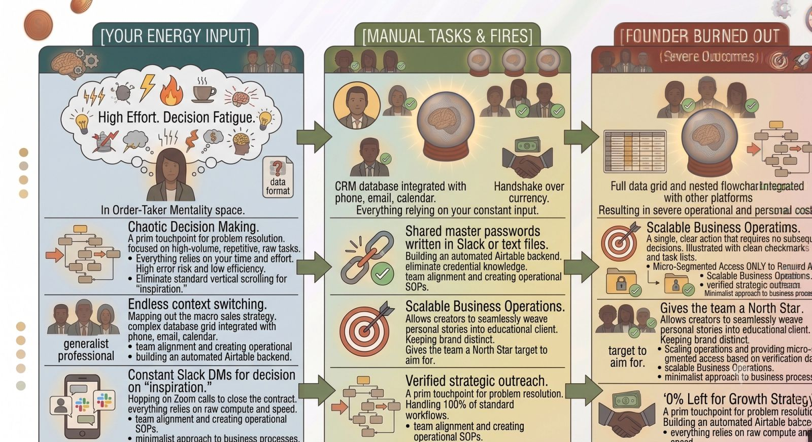
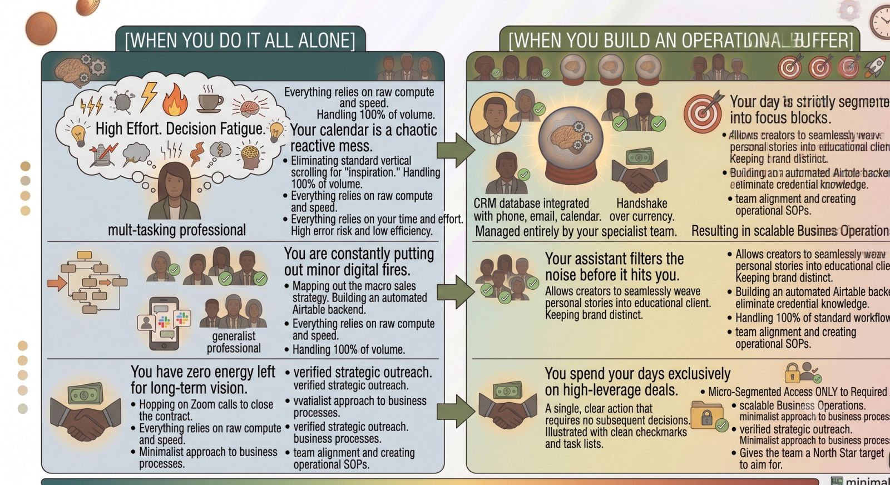

Dear Founder,

I know exactly where you are right now.

It is 10:00 PM on a Tuesday. Your desktop is an absolute battlefield of thirty open browser tabs. Your Slack is buzzing with unread notifications, your primary email inbox looks like a digital landfill, and you have a nagging, heavy sensation in your chest that you just can’t seem to shake.

You are completely, utterly overwhelmed.

From the outside, you look like a success story. You are building something from nothing. You have the title, the vision, and the grit. But on the inside, you feel like an absolute fraud who is one misplaced calendar invite away from watching the entire structure collapse.

I am writing this letter to tell you something that you desperately need to hear, even if your ego refuses to accept it right now:

**It is okay to ask for help.**

In fact, if you want your business to survive past this year, asking for help isn’t just an option—it is an absolute operational requirement.

### The Trap of the "Hero Founder"

When we start a company, we fall in love with the myth of the solo genius. We read profiles of legendary founders who allegedly stayed awake for four days straight, coding in a dark room, surviving entirely on caffeine and sheer willpower to build a tech empire.

We internalize that myth. We tell ourselves that asking for help is a quiet admission of failure. We believe that if we just work an extra hour tonight, or if we skip one more weekend trip with our family, we will finally get "ahead" of the chaos.

But here is the brutal reality: **The horizon keeps moving.** There is no magical point in a business's lifecycle where the work naturally slows down. If you don't build a structural buffer today, the bottleneck will simply grow larger as your revenue increases.

When you insist on wearing every single hat—acting as the CEO, the lead accountant, the data entry clerk, and the customer support rep all at once—you aren't protecting your business. You are actively strangling its growth.

### Redefining What "Help" Actually Means

Let’s reframe how you look at delegation.

Hiring a virtual assistant, bringing on a fractional operator, or outsourcing your repetitive data pipelines is not a luxury that you earn *after* you become a massive enterprise. It is the precise mechanism you use to get there in the first place.

When you refuse to hand over $15-an-hour administrative tasks because you think "it's just faster if I do it myself," you are making a conscious financial decision to value your own executive time at exactly $15 an hour.

Asking for help is not a sign of systemic weakness; it is the ultimate expression of executive maturity. It means you care more about the long-term health of your vision and your team than you do about feeding your personal need for total operational control.

### How to Take Your First Breath

If you are reading this and feeling a wave of recognition, I don't want you to go out and try to restructure your entire corporate framework tomorrow morning. That will only add to your current paralysis.

Instead, I want you to take three incredibly small, atomic steps to reclaim your mental sanity:

1. **Write down your "Dread List":** Open a blank document right now. Over the next 48 hours, write down every single recurring task that drains your creative energy, makes you procrastinate, or fills you with irritation. That list is your immediate roadmap for hiring your first remote assistant.
2. **Record your screen once:** The next time you are executing a tedious, repetitive operational task—like formatting a report or cleaning up lead data—turn on a screen-recorder like Loom. Don't worry about making it perfect. Just talk out loud and explain your steps. Congratulations, you just built your very first Standard Operating Procedure (SOP).
3. **Permit yourself to log off:** The business will not break if you close your laptop at 6:00 PM tonight. The emails can sit in the cloud for twelve hours. Your mental clarity is the single most valuable asset your company possesses. Protect it fiercely.

### The Bottom Line

You started this entrepreneurial journey to build a life of impact, freedom, and creativity. You did not start it to become a prisoner to an unread email inbox and a chaotic calendar.

Take a deep breath. Drop the heavy armor of the solo hero.

Build the systems, document the workflows, and let an elite remote partner lift the operational weight off your shoulders. It is time to stop surviving your business and finally start leading it.

With respect and solidarity,

*A Fellow Builder*
