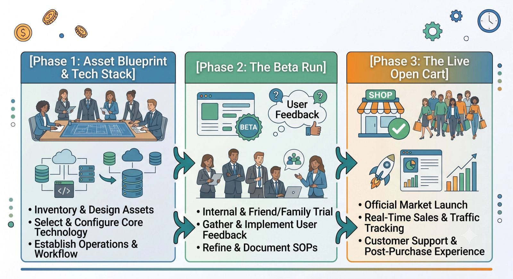
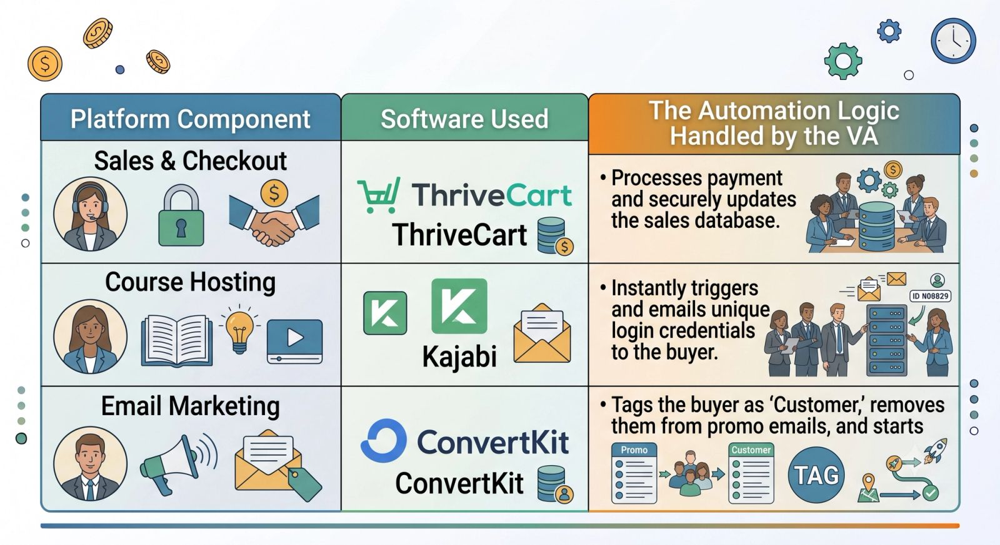

Launching a digital product is often marketed as the ultimate path to passive income. What the gurus don’t tell you, however, is the sheer amount of active, stressful work required to get that product to the starting line.

Between mapping out email sequences, configuring payment gateways, uploading course modules, and designing sales pages, a launch can quickly morph into an operational nightmare.

Recently, an online creator and coach approached me on the brink of burnout. They had a premium digital masterclass ready to change lives, but they were completely stuck in the "launch tech weeds."

Here is the exact case study of how we partnered to execute a highly successful, stress-free digital product launch.

## The Challenge: A Creative Vision Trapped by Technical Friction

My client was an absolute genius at content creation and coaching, but they were entirely overwhelmed by the execution logistics. They were facing three major bottlenecks:

- **Zero Tech Integration:** Their email marketing platform, checkout software, and course hosting site weren't talking to each other.
- **No Centralized Timeline:** Deliverables were scattered across notebooks, sticky notes, and loose thoughts, leading to missed internal deadlines.
- **Content Fatigue:** They were too exhausted from trying to build the backend infrastructure to write the actual marketing copy.

## The Strategy: Building the Launch Engine

To eliminate the friction, I stepped in as the launch project manager and technical integrator. We broke the rollout down into three systematic phases.

### 1. Centralizing the Launch Dashboard

First, I moved everything out of my client's head and into a unified project management dashboard. We mapped out a strict, reverse-engineered timeline counting down to launch day. Every email, graphic, and landing page asset was assigned a hard deadline, ensuring we knew exactly what needed to happen each morning.

### 2. Wiring the Automated Tech Funnel

Instead of letting my client struggle with APIs and webhooks, I took over the entire technical assembly line. I built a seamless, automated ecosystem using their preferred tools:

### 3. Assembling the Asset Library

While my client focused on refining the masterclass video content, I took charge of organizing the creative assets. I built high-converting sales page layouts, designed promotional social media graphics using their brand kit, and scheduled a 7-part launch email sequence.

## The Results: Stress-Free Execution and Five-Figure Success

By treating the launch like a mechanical process rather than a chaotic scramble, launch week felt remarkably quiet.

> **The Outcome:** The cart opened seamlessly, the automations fired perfectly without a single technical glitch, and the launch brought in **$18,750** in its very first week.

Most importantly, my client didn't spend launch week stressed out or troubleshooting broken links. They spent it inside their private community, celebrating and welcoming their 400+ new students.

## Your Next Launch Doesn't Have to Hurt

If you are holding back on releasing an ebook, an online course, or a premium community because you dread the technical setup, remember: **you don’t have to do it alone.**

By partnering with a specialized virtual assistant to manage the logistics, tech funnels, and timelines, you can stay firmly in your zone of genius while your business scales seamlessly in the background.
