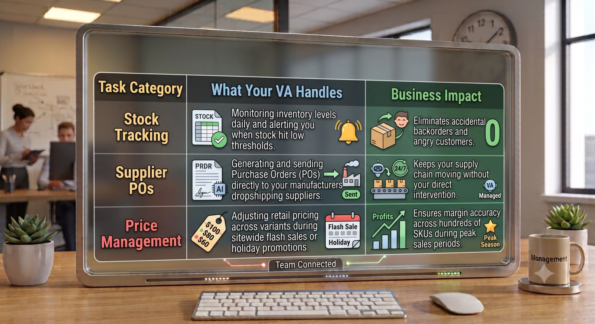

Running a Shopify store is an exciting venture, but it doesn’t take long for the sheer volume of daily tasks to catch up with you. What starts as a passion project quickly morphs into an endless cycle of updating stock counts, chasing down delayed packages, writing product descriptions, and answering the same customer service emails over and over again.

If you spend all your time keeping the lights on, you don't have the time or mental energy to actually grow your business.

That is where an **E-commerce Virtual Assistant (VA)** comes in. An e-commerce VA is a remote professional who specializes in backend operations, technical maintenance, and customer relations specifically for online storefronts. Here is a deep dive into the exact tasks you can hand off to a Shopify VA to reclaim your time and scale your sales.

### 1. Front-End Product & Store Management

Keeping your digital storefront fresh, accurate, and optimized is a full-time job. A trained Shopify VA can take complete ownership of your product catalog.

- **Product Uploads & Listings:** Hand over your raw product data, images, and pricing. Your VA can format the listings, assign them to the correct collections, and optimize tag attributes.
- **SEO-Friendly Copywriting:** Instead of copy-pasting boring manufacturer specifications, your VA can draft engaging, keyword-rich product descriptions designed to convert traffic.
- **Basic Page Tweaks:** Whether updating a banner for a seasonal sale, building a new promotional landing page, or tweaking navigation menus, a tech-savvy VA can manage these changes directly inside Shopify’s theme editor.

### 2. Inventory & Supplier Coordination

Running out of stock kills your momentum, while over-ordering ties up crucial cash flow. A VA can keep your logistics moving smoothly behind the scenes.

### 3. Order Fulfillment & Logistics Overhaul

While third-party logistics (3PLs) or dropshipping integrations handle physical shipping, the digital workflow still requires active human supervision.

> **The Fulfillment Pipeline:** Your VA can log into your Shopify backend daily to verify payment capture, review orders flagged for fraud risk, and push approved orders to your fulfillment apps (like ShipStation, CJ Dropshipping, or Zendrop).

If a tracking number is missing, a delivery fails, or an address needs correcting, your VA steps in immediately to fix the issue before the customer even notices.

### 4. 5-Star Customer Support

Customer service can make or break an e-commerce brand. It is also the biggest time drain for store owners. By integrating helpdesk software like **Gorgias**, **Zendesk**, or **Re: amaze** with your Shopify store, your VA can manage your entire support queue.

- **Where is my order (WISMO)?** VAs can quickly look up tracking details and provide immediate updates.
- **Returns & Exchanges:** Processing refunds, generating return shipping labels, and updating inventory items following store policy.
- **Review Moderation:** Replying to positive customer reviews on platforms like Loox or Judge.me, and flagging negative experiences for fast resolution.

### How to Prepare Your Shopify Store for a VA

Before you bring a virtual assistant into your digital storefront, you need to make sure you can hand over the keys securely.

1. **Never share your master login:** Create a staff account under **Settings > Users and Permissions** in Shopify. Give them access *only* to the specific apps, products, and order histories they need to do their job.
2. **Build an SOP for Customer Queries:** Write down a basic FAQ sheet or template document. Outline exactly how you want refunds handled, what to do if a package is lost, and the brand tone they should use.

### Shift from Operator to Owner

You didn't start an e-commerce business to spend your life copy-pasting tracking numbers and editing photo backgrounds. By offloading these repetitive, tactical tasks to an experienced e-commerce virtual assistant, you free up your calendar to focus on high-impact growth strategy: product development, influencer partnerships, and paid acquisition.
