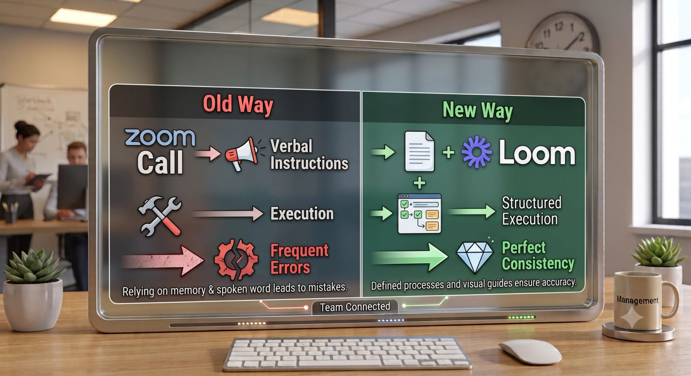
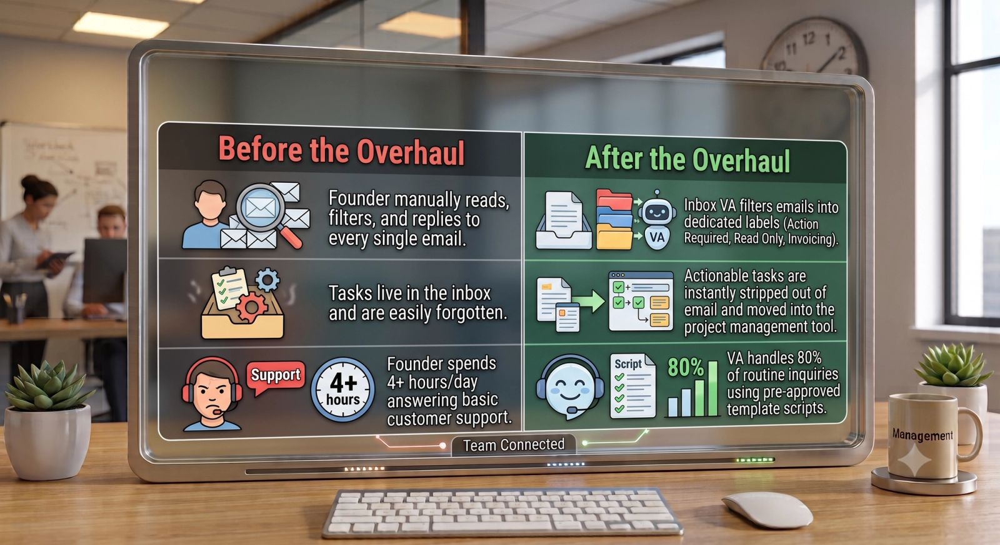

As an operations consultant, my calendar is a front-row seat to the behind-the-scenes chaos of growing businesses. Clients usually come to me when they are hitting a ceiling: revenue is steady or growing, but their daily schedule is completely maxed out, their team is confused, and things are starting to drop through the cracks.

This past month, I wrapped up deep-dive operational audits and system overhauls for several business owners. Looking back at the data, a few distinct themes emerged.

If your business feels heavy, chaotic, or difficult to scale right now, chances are you are making at least one of these three common operational mistakes. Here is exactly what went wrong for my clients this month—and how we fixed it.

### Mistake 1: The "Software Octopus" (Tool Overlap & Clutter)

One of my clients—a fast-growing creative agency owner—came to me because they felt like they were hemorrhaging money on software subscriptions, yet their team was still constantly losing files and missing project details.

When we mapped out their tech stack, we discovered they were paying for:

- **Asana** (for task tracking)
- **Trello** (because one project manager preferred it)
- **Slack** (for internal chat)
- **WhatsApp** (for urgent client issues)
- **Google Drive** (for assets)
- **Dropbox** (because an old contractor used it)

Information was scattered everywhere. The team was wasting hours every week just hunting down links and trying to figure out which tool held the final source of truth.

> **The Fix:** We executed a brutal tech-stack audit. We migrated everything entirely into **ClickUp** for project management and resource storage, kept **Slack** strictly for team chatter, and canceled the rest.

- **The Result:** We saved the client over **$350/month** in redundant software fees and eliminated hours of daily digital friction for their team.

### Mistake 2: The "Just Do It" Delegation Trap

Another client—a brilliant consultant who recently hired their first two virtual assistants—was frustrated that their team was making constant errors on weekly data reporting and client onboarding. *“I don’t get it,”* the client told me. *“I told them exactly what I wanted done!”*

Upon digging deeper, I realized the delegation style was entirely verbal. The client would hop on a quick Zoom call, explain a complex multi-step process from memory, and say, *"Got it? Great, do that every week."*

Without written documentation, the VAs were forced to rely on memory, leading to inconsistent execution and massive anxiety.

**The Fix:** We paused execution for one week to build a minimal **SOP (Standard Operating Procedure) Library**. For every recurring task, we created a simple doc containing:

1. A 3-minute **Loom video** walking through the live process.
2. A step-by-step **written checklist**.
3. Clear definitions of what a "completed" task looks like.

Now, when a task is assigned, the team has an exact blueprint to follow. Mistakes plummeted to zero within two weeks.

### Mistake 3: Treating the Inbox as a To-Do List

The final major bottleneck I tackled this month involved a founder who spent an average of **4 hours a day** in their email inbox. They were using their inbox as their primary project management system. If a client emailed a request, that email sat unread or starred until the founder could personally execute the task.

This created two massive problems:

1. The inbox became an incredibly stressful, disorganized mess.
2. The founder became a total bottleneck, stalling project delivery times for clients.

**The Fix:** We built a strict "Inbox Gatekeeper" system. We trained their administrative VA to manage the main inbox using a set framework. The VA now filters out junk, handles routine support using template responses, and extracts actual work requests directly into the team's project management software.

The founder now logs into an inbox that only requires **30 minutes** of targeted attention per day.

### Simplification is the Secret to Scaling

If there is one overarching lesson from this month's client work, it is this: **Complexity kills growth.** When your business feels overwhelming, the answer is rarely to add more tools, more people, or more hours to your workday. The answer is almost always to subtract the clutter, streamline your workflows, and build clearer systems for the team you already have.
