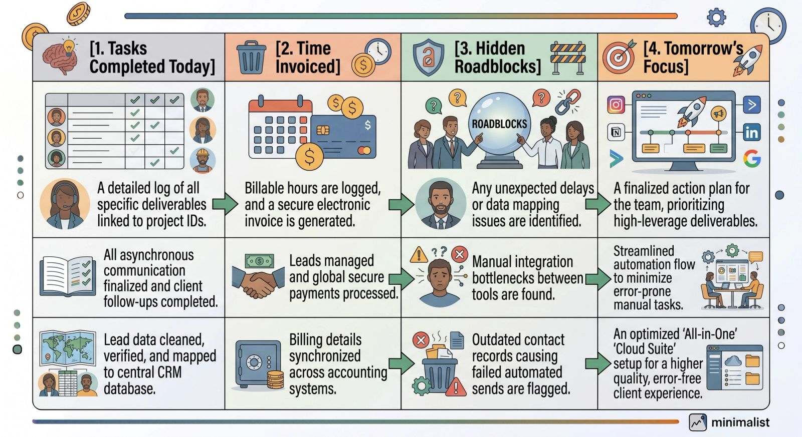
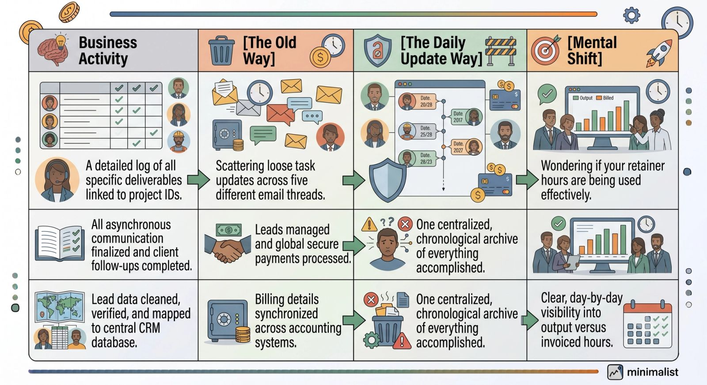

When business owners first hire a Virtual Assistant (VA), they usually imagine immediate operational relief. But all too often, the relationship gets bogged down by communication friction.

The client worries about what their VA is working on, wondering: *"Are they stuck? Are they billing me for the right hours?"* Meanwhile, the VA is working in a vacuum, thinking: *"I hope I'm prioritizing the right things. I don't want to micromanage my client with ten Slack messages a day."*

The solution to this anxiety isn't jumping on more Zoom calls. It’s establishing an asynchronous, predictable feedback loop.

Enter the **Daily Update Form**. This dead-simple, highly structured daily briefing ensures the client stays fully informed and the VA stays completely aligned—without a single unnecessary meeting.

## The 4-Part Daily Communication Architecture

A perfect daily update shouldn't look like a long, unstructured essay. It should be an easily scannable, data-driven summary built around four vital pillars:

By standardizing your daily updates around this structure, you eliminate guessing games and build immediate operational trust.

## The Plug-and-Play Daily Update Template

Copy and paste the exact text template below into your shared communication channel (Slack, email, or your project management tool) to deploy it with your team today.

### The Template

> **### 🗓️ VA Daily Update: [Insert Date]**
**1. ✅ What I Completed Today:**

- *[Task Name]* — *[Brief outcome or link to deliverable]*
- *[Task Name]* — *[Brief outcome or link to deliverable]*

> **2. ⏱️ Total Hours Logged:**

- **Time Spent:** *[X.X]* Hours.

> **3. 🛑 Current Roadblocks / Questions:**

- *[State any blockers here. If none, write "None! All clear."]*

> **4. 🎯 Main Focus for Tomorrow:**

- *[Priority 1]*
- *[Priority 2]*

## Why This Simple Form Completely Transforms Outsourcing

### It Eliminates Micromanagement

Business owners micromanage when they feel out of the loop. When a client knows a structured, predictable report will land in their inbox or Slack channel at the end of every business day, they completely stop hovering or sending "quick check-in" pings.

### It Highlights Roadblocks Before They Become Disasters

If a VA is stuck on a password issue or a broken software integration, a daily update form forces that bottleneck to the surface immediately. You can solve a small roadblock in 30 seconds rather than realizing a week later that an entire project ground to a halt.

#### It Enforces Clean Record Keeping

> **Pro-Tip: Automate Your Daily Form Collection:** Want to make this process even more seamless? Instead of manual copying and pasting, use a tool like **Slack workflows**, **Google Forms**, or **Typeform**. Set it up so your VA gets a gentle automatic reminder 15 minutes before their shift ends to fill out the form. The responses can automatically feed into a dedicated `#va-updates` channel for you to review whenever you sit down with your evening coffee.

## Download the Complete Outsourcing Kit

Clear communication is the bridge between chaotic outsourcing and seamless business scaling. By turning this simple daily brief into a non-negotiable habit, you give your virtual assistant the clarity they need to excel, while giving yourself the peace of mind required to truly step into the CEO role.
