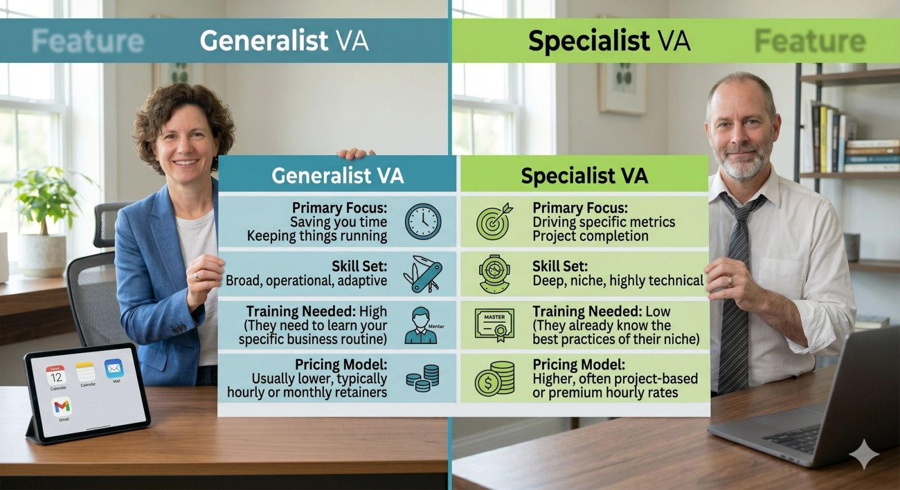

You’ve finally decided to scale your business by hiring a Virtual Assistant. You’re ready to offload the work, reclaim your calendar, and stop working 60-hour weeks.

But as soon as you start looking at profiles, you hit a massive fork in the road: **Should you hire a Generalist VA or a Specialist VA?**

Choosing the wrong type of virtual assistant is one of the main reasons business owners give up on outsourcing entirely. If you hire an administrative generalist to run your paid ad campaigns, you will lose money. If you hire an expensive SEO specialist to sort your inbox, you are wasting capital.

Let's break down the exact differences so you can make the right hire for your business today.

## The Generalist VA: The Swiss Army Knife

A Generalist VA—often referred to as a Virtual Executive Assistant or General Admin VA—is a jack-of-all-trades. Their primary superpower is the **organization and execution of daily business operations.**

### What They Do Best:

- **Inbox & Calendar Management:** Filtering spam, scheduling meetings, and protecting your time.
- **Customer Support:** Answering routine inquiries, handling basic tickets, and managing live chats.
- **Data Entry & CRM Updates:** Keeping your client records clean and organized.
- **Basic Content Scheduling:** Taking a blog post or graphic you created and posting it across your social channels.

### Best Suited For:

Founders and small team leaders who are entirely overwhelmed by "busywork." If your biggest bottleneck is that you have no time to think because you are stuck responding to emails and scheduling calls, you need a Generalist.

## The Specialist VA: The Laser-Focused Expert

A Specialist VA is someone who has dedicated their career to mastering **one specific technical skill or platform.** They don’t need training on *how* to do the job; they are brought in to execute a specific strategy.

### What They Do Best:

- **Tech-Heavy Marketing:** Managing complex paid ad campaigns (Meta/Google Ads) or advanced SEO optimization.
- **Advanced Content Creation:** Video editing for Reels/TikTok, graphic design, or copywriting.
- **Technical Systems Setup:** Building complex automation funnels in tools like Zapier, HubSpot, or Salesforce.
- **Bookkeeping & Financials:** Managing payroll, matching receipts, and preparing tax documents.

### Best Suited For:

Businesses that already have smooth daily operations but need to execute a specific, high-skill project. If you know *what* needs to be done (e.g., "We need to launch a podcast") but nobody on your team has the technical skill to do it, you need a Specialist.

## Direct Comparison: Generalist vs. Specialist

To help you visualize where your gaps lie, here is a quick breakdown of how these two roles match up:

## The Golden Rule for Making Your Decision

If you are still on the fence, ask yourself this simple question:

> **"Am I looking for someone to manage my day-to-day workload, or am I looking for someone to solve a specific business problem?"**

- If you need **breathing room**, hire a **Generalist**.
- If you need **expertise**, hire a **Specialist**.

### The Hybrid Scaling Roadmap (How to Do Both)

Most successful scaling businesses don't stop at one. The typical roadmap looks like this:

1. **Phase 1:** Hire a **Generalist VA** first to clear 10–15 hours off your plate every week.
2. **Phase 2:** Use those newly recovered hours to focus on strategy and identify your biggest revenue bottleneck.
3. **Phase 3:** Hire a **Specialist VA** (like a media buyer or a technical writer) to smash through that specific bottleneck.

By pairing the broad operational support of a generalist with the pinpoint execution of a specialist, you build an agile, efficient team capable of scaling your business to the next level without burning you out.
