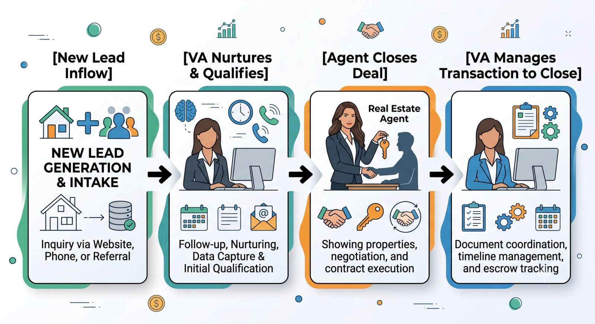
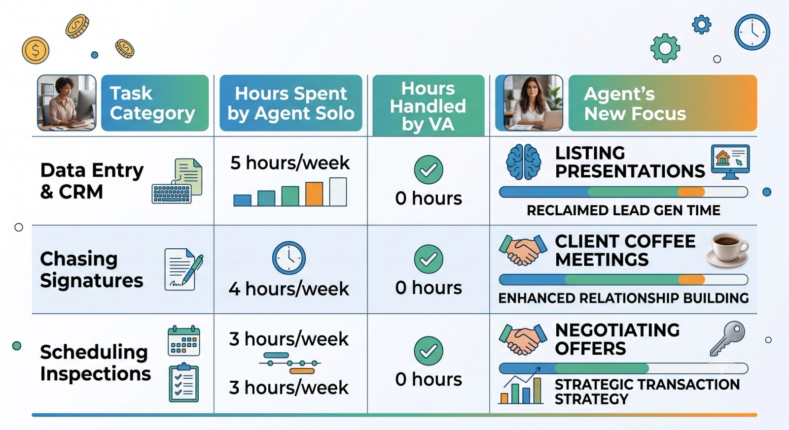

In real estate, top-producing agents aren't necessarily working harder than everyone else—they are just spending their time on the right things. While elite agents are out shaking hands, showing properties, and closing deals, an unsung hero is keeping the business from falling apart in the background.

That hero is the **Real Estate Virtual Assistant (VA)**.

Behind every successful transaction is a mountain of paperwork, endless follow-ups, and strict compliance deadlines. Here is a look behind the scenes at how a specialized real estate VA manages leads and transactions to keep the revenue flowing.

## The Two Pillars of a Real Estate VA's Role

To build a scalable real estate business, you need systemized consistency in two distinct phases of the client journey: **Lead Management** (the front end) and **Transaction Coordination** (the back end).

## Phase 1: Lead Management (No Lead Left Behind)

An agent's pipeline is their lifeline, but speed-to-lead is everything. If a prospective buyer or seller waits two hours for a response, they’ve already moved on to a competitor. A real estate VA acts as your digital traffic controller.

### \* CRM Organization and Segmentation

A VA ensures your CRM (like LionDesk, KvCORE, or Salesforce) isn't a digital graveyard. They tag incoming leads by type (buyer, seller, investor), neighborhood interest, and hot/cold status.

### \* Immediate Speed-to-Lead Triage

When a new lead populates from Zillow, Facebook, or your website, the VA instantly triggers automated drip campaigns, sends an initial text, or handles the preliminary intake screening so the lead feels acknowledged immediately.

### \* Consistent Database Nurturing

Most deals don't close on day one. A VA schedules monthly newsletters, sends automated holiday greetings, and sets up property alerts for cold leads, keeping you top-of-mind until they are ready to buy or sell.

## Phase 2: Transaction Coordination (Contract to Close)

Once a contract is signed, the real work begins. A single missing signature can delay a closing, cost thousands, or trigger a compliance lawsuit. A specialized real estate VA manages the transaction checklist with military precision.

### \* Document Compliance Management

They review the purchase agreement, counter-offers, and disclosures to ensure everything is filled out, initialed, and signed. They then upload these files to your broker’s compliance portal (like SkySlope or DocuSign Rooms).

### \* Timeline and Deadline Tracking

A transaction has dozens of moving parts. Your VA maps out the critical dates—escrow deposit deadlines, inspection contingency windows, appraisal timelines, and loan approval dates—and adds them to your calendar with proactive reminders.

### \* Stakeholder Communication

A VA acts as the central hub of communication. They coordinate with the escrow officer, title company, home inspector, and the co-op agent to pass along required documents and ensure everyone is aligned for a smooth closing day.

## The Real Estate VA Impact: By the Numbers

**The Bottom Line:** A real estate VA doesn't just take tasks off your plate; they protect your reputation. By ensuring no balls are dropped during escrow and no leads are ignored in the CRM, they turn a chaotic hustle into a predictable, scalable business machine.
