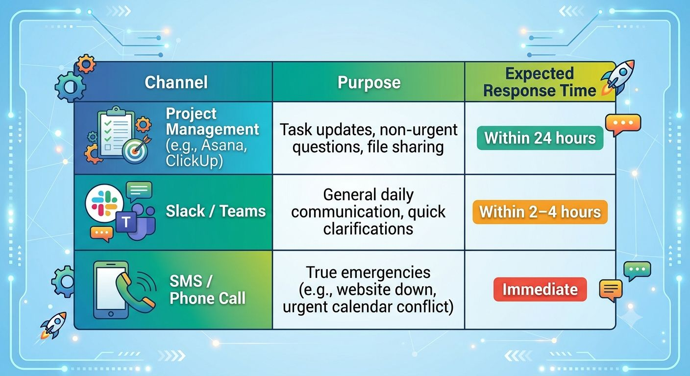

Hiring a remote assistant is supposed to give you your time back. But if you spend half your day checking their active status, sending *"Quick update?"* messages every hour, or reviewing every single email draft, you haven’t actually freed up your schedule. You’ve just given yourself a second full-time job: **babysitting.**

Micromanagement is even easier to fall into with a remote team because you can't see the work happening in real time. Fear of the unknown kicks in, and suddenly, you are suffocating the exact productivity you hired them for.

If you want a highly capable, independent remote assistant, you have to change how you manage. Here is how to stop hovering from afar.

### 1. Shift from "Hours Logged" to "Outcomes Delivered"

In a traditional office, managers often mistake physical presence for productivity. Remotely, this translates to tracking green active dots or monitoring software keystrokes. This builds a culture of anxiety, not efficiency.

Your remote assistant doesn't need to be staring at a screen for eight consecutive hours to be valuable. They need to get the job done right.

- **The Fix:** Measure results, not minutes. If their job is to schedule your social media posts for the week, it shouldn't matter whether they do it at 9:00 AM or 9:00 PM, as long as the posts are high-quality and ready before the deadline.

### 2. Build an Asynchronous Communication Framework

If you are constantly pinging your assistant on Slack or WhatsApp for instant replies, you are breaking their focus and forcing them into a reactive state.

- **The Fix:** Establish communication boundaries. Categorize your channels so your assistant knows what requires immediate attention and what can wait.

### 3. Replace Constant Pings with a Structured Stand-up

Micromanagement usually stems from a lack of visibility. You ask for updates all day because you don't know what they are working on. You can eliminate this anxiety by creating a predictable feedback loop.

- **The Fix:** Implement a daily or tri-weekly **Asynchronous Stand-up**. Every morning, have your assistant post a quick update in your chat tool covering three things:
  1. What they accomplished yesterday.
  2. What they are focusing on today.
  3. Any roadblocks they are facing?

Suddenly, you have total visibility without ever having to ask, *"What are you working on?"*

### 4. Create an "Ownership" Mindset, Not a "Task-Taker" Mindset

If you give your assistant micro-tasks (e.g., *"Email John,"* then *"Now upload this file,"* then *"Now reply to this comment"*), they will constantly wait for your next command. You become the ultimate bottleneck.

- **The Fix:** Delegate entire processes, not just isolated tasks. Instead of asking them to fix a single calendar mistake, give them **ownership of your inbox and calendar management**. Provide them with a clear set of guidelines (your preferred meeting times, buffer zones, VIP contacts) and let them manage the system.

### 5. Document Everything (Standard Operating Procedures)

You can’t expect an assistant to work independently if the instructions live entirely in your head. When you don't document your processes, your assistant is forced to ask a million questions—which you might misinterpret as incompetence or a lack of initiative.

- **The Fix:** Create a simple library of Standard Operating Procedures (SOPs). The easiest way to do this? The next time you perform a routine task, record your screen using a tool like Loom. Explain what you are doing out loud, and hand the video over to your assistant to transcribe into a step-by-step checklist.

## Trust is a Two-Way Street

To stop micromanaging, you have to accept a simple truth: **Your remote assistant will make mistakes, and they will likely do things a little differently than you would.** But mistake-making is how they learn your business. By setting crystal-clear expectations, providing the right documentation, and stepping back to let them execute, you build an empowered partner who can truly run aspects of your business *for* you.
