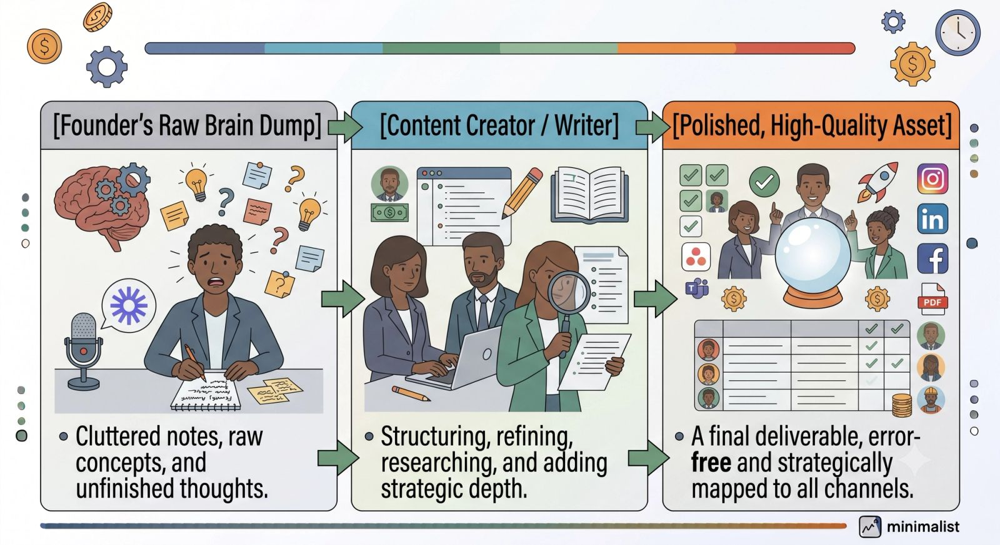
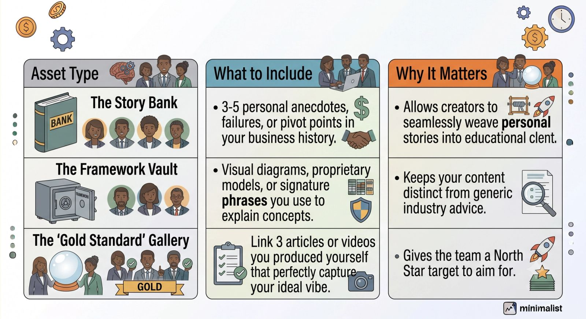

## How to Outsource Your Content Creation without Sacrificing Your Voice

As a founder, your brand’s voice is your most valuable asset. It’s the reason your audience trusts you, your clients hire you, and your community stays engaged.

But as your business grows, content creation becomes a massive bottleneck. Writing every blog post, drafting every newsletter, and scripting every video yourself simply doesn't scale. You know you need to outsource, but you’re terrified of a ghostwriter turning your sharp, authentic insights into generic, AI-sounding corporate fluff.

The good news? You can hand off execution without losing your identity. Here is how to scale your content engine while keeping your unique voice entirely intact.

### Phase 1: Codify Your "Voice DNA"

You can't expect a creator to mimic your voice if you haven't defined what it actually sounds like. Before hiring a writer or content agency, you must build a **Brand Voice Style Guide**.

Skip the vague corporate values like "professional yet friendly." Instead, build a concrete framework:

- **The Vocabulary Matrix:** List the words you use constantly, and contrast them with words you would *never* say. (e.g., "We say *tactics*, we don't say *synergy*.")
- **The Tone Spectrum:** Define where you sit on key stylistic spectrums. Are you casual or formal? Witty or deadpan? Informational or storytelling-driven?
- **Formatting Quirks:** Do you love short, punchy paragraphs? Do you use emojis? Do you lean heavily on bold text to guide the reader? Document these visual habits.

### Phase 2: Shift from "Writer" to "Source"

The biggest mistake founders make is asking a content creator to research a topic from scratch. When a writer Googles a topic, they end up regurgitating the same generic points everyone else is ranking for. Your voice disappears because your *unique perspective* isn't there.

Instead, shift your role from the **writer** to the **subject matter expert (SME)**.

To make this seamless without wasting your time, use the **Loom & Transcription Framework**:

1. **Record a 5-minute brain dump:** When a content topic is chosen, open a recording tool (like Loom) and talk through your thoughts. Share your specific counterintuitive
2. Opinions, real client case studies, and personal frameworks.
3. **Hand off the raw audio:** Your creator will take that transcription—which is already packed with your natural vocabulary, phrasing, and unique insights—and use it as the foundational scaffolding for the content.

### Phase 3: Build a Shared Asset Library

To capture your voice, your creative team needs continuous context. Give them access to a centralized repository of your past work so they can study your natural rhythm.

### Phase 4: Create a Feedback Loop (The 80/20 Rule)

When you receive the first few drafts from a new creator, don't expect 100% perfection. Your goal is for the writer to get the content to **80% completion**—nailing the structure, the facts, and the core arguments.

The remaining 20% is your "magic dust."

During the editing phase, don't just rewrite lines in silence. Use comments to explain *why* you are changing things.

> **Example Edit:** *"Let’s change 'We utilize this software' to 'We lean on this tool.' The word 'utilize' feels a bit too stiff and corporate for my style."*

Over the course of 3 to 4 content cycles, this real-time feedback loop trains your creator's ear. Eventually, that 80% draft turns into a 95% draft, and your editing time drops to mere minutes.

### The Bottom Line

Outsourcing content creation isn't about finding someone to think *for* you; it’s about finding someone to clean up, structure, and polish the thoughts *already inside your head*.

By building a clear voice guide, treating yourself as the raw information source, and providing constructive feedback, you can step away from the keyboard and scale your brand's authority on autopilot.
