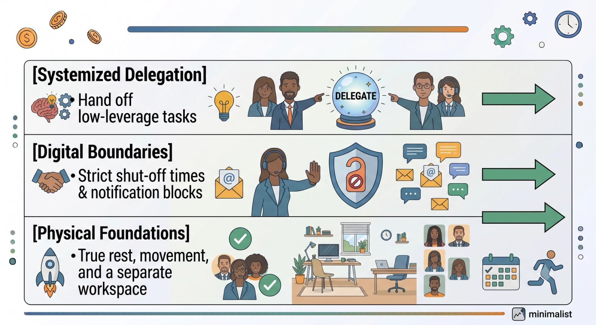
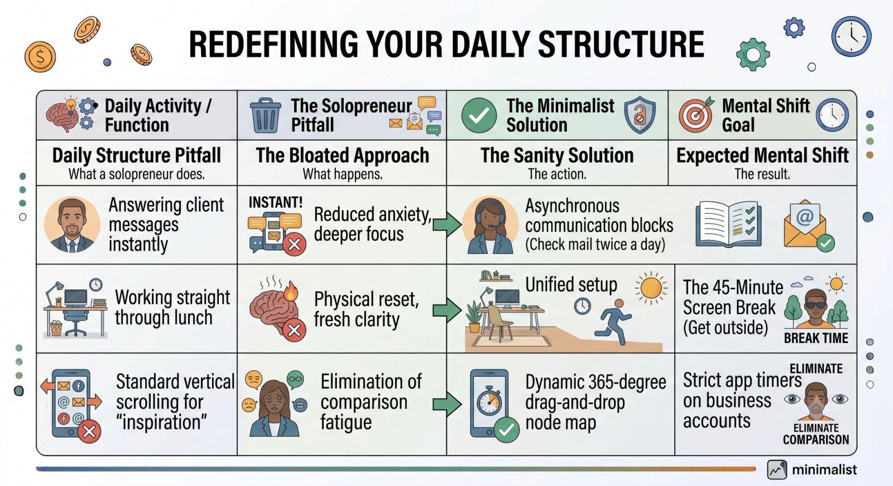

When you first launch a solo business, the freedom is intoxicating. You can work in your sweatpants, choose your own clients, set your own hours, and skip the soul-crushing corporate meetings.

But a few months in, a harsh reality usually sets in: **When you are your own boss, your boss is a maniac.**

Without corporate structures, you suddenly find yourself acting as the CEO, the marketing department, the customer service agent, the accountant, and the janitor. You answer emails at 11:00 PM, look at your phone during dinner, and carry a constant, low-level hum of anxiety that you should be doing more.

Solopreneurship doesn't have to mean voluntary burnout. Here is a practical, boundaries-first guide to protecting your mental health while building a highly successful business.

## The Solopreneur Sanity Pyramid

To build a sustainable solo business, you must treat your own energy and mental health as your company's most valuable asset. If you break, the entire enterprise halts.

## 4 Non-Negotiable Sanity Protocols

### 1. Establish Hard Digital Fences

If your clients can reach you on Slack, WhatsApp, email, and Instagram DM at any hour of the day, you aren't a business owner—you are on call.

- **The Action:** Move all client communications exclusively to **one** platform (like a dedicated email address or a client portal). Turn off all work-related lock screen notifications on your personal phone, and set an explicit "Digital Sunset" time (e.g., 6:00 PM) when your laptop is closed and put out of sight.

### 2. Schedule Your "CEO Rest" First

Most solopreneurs look at their calendar, fill it with client work and admin tasks, and then try to fit the rest into whatever tiny pockets of time are left over. This is a direct ticket to burnout.

- **The Action:** Block out your weekends and an hour of daily movement *before* you allow anyone to book a meeting with you. Treat your personal time with the same respect and urgency as a high-paying client call. If it's on the calendar, it is a non-negotiable appointment with your health.

### 3. Create a "Done" Ritual

When you work from home, the transition between "work mode" and "life mode" is incredibly blurry. Without a physical commute to separate the two, your brain struggles to turn off.

- **The Action:** Create a simple 5-minute shutdown routine at the end of every workday. Clear your physical desk, write down your top three priorities for tomorrow in a paper notebook, and verbally say out loud: *"The workday is done."* This small psychological trigger gives your brain permission to stop scanning for problems.

## The Ultimate Sanity Saver: Stop Flying Solo

The ultimate trap of solopreneurship is believing that you have to do everything by yourself just because you are a solo founder.

The moment you can afford it, hire a **Virtual Assistant** to handle the predictable, repetitive elements of your business. Let them sort through your crowded inbox, manage your scheduling links, format your blog posts, and handle basic client troubleshooting.

Knowing that someone else is keeping the wheels turning allows you to step away from your desk without feeling guilty.

## Build a Business, Not a Prison

You did not leave your old job to build a new 24/7 job where you treat yourself worse than any manager ever could.

By automating your systems, setting unshakeable digital boundaries, and leaning on a trusted virtual assistant, you can protect your peace of mind and build a business that supports your life—rather than consuming it.
