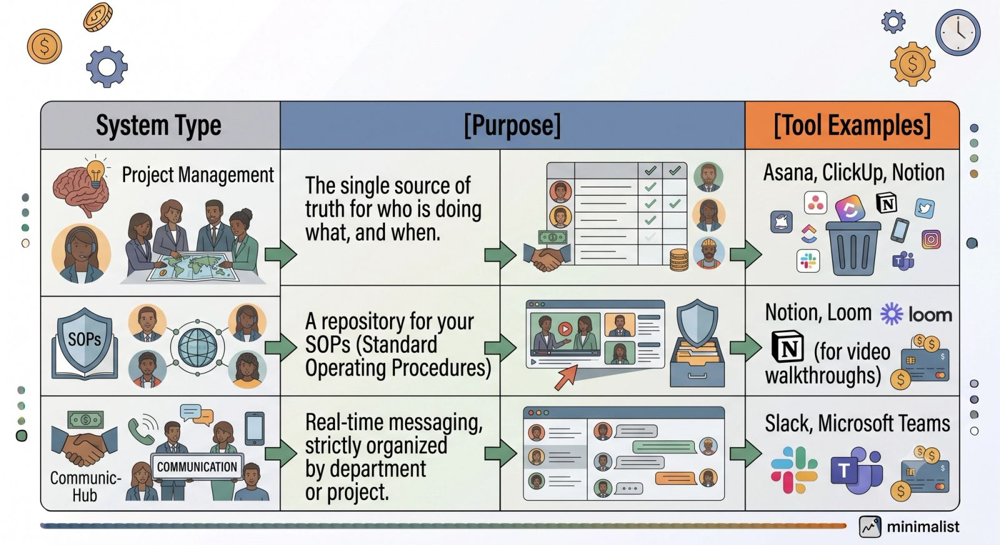

There comes a tipping point for every growing business. You started out doing everything yourself, eventually hired your first Virtual Assistant (VA), and felt an immediate wave of relief.

But now, that familiar bottleneck is creeping back.

Your VA is maxed out, your Slack messages are a chaotic mess, and you’re spending more time managing day-to-day fires than focusing on high-level growth. You don't just need another assistant—you need a **lean remote team**.

Transitioning from a single generalist VA to an agile, specialized squad is how you scale your business output without exponentially increasing your overhead. Here is your roadmap to making the shift smoothly.

### Phase 1: Audit Before You Hire

Before you post a single job description, you need to understand exactly where the operational cracks are appearing.

- **The Time Audit:** For one week, track every task you and your current VA handle. Group them into buckets like customer support, marketing, lead generation, and technical operations.
- **Identify the Specialized Needs:** A generalist VA is great for clearing inbox clutter, but they shouldn't be writing your sales copy, running your paid ads, *and* managing your bookkeeping. Look for the bucket that requires specific expertise and is eating up the most time. That’s your next hire.

### Phase 2: Build the Infrastructure

A single VA can operate on "verbal instructions" and lose Slack messages. A team will collapse under that lack of structure. Before adding headcount, you must build a digital headquarters.

> **Founder Tip:** If it’s not written down in an SOP, it doesn’t exist. Document your core processes *before* onboarding new team members so they can hit the ground running.

### Phase 3: The "Pod" Framework for Hiring

When building a lean team, you aren't looking to hire ten people at once. You want to build small, highly efficient "pods" focused on specific business outcomes.

Instead of hiring three more general VAs, hire specialists for your biggest bottleneck. For example, a growth pod might look like this:

1. **The Content Writer:** Focuses entirely on creating marketing assets.
2. **The Tech/Ops VA:** Handles website updates, email scheduling, and automations.
3. **Your Original VA:** Steps up as a Project Manager/Operations Coordinator to oversee the workflow.

By promoting your original VA into a coordination role, you leverage their deep knowledge of your business while freeing up your own time.

### Phase 4: Shifting Your Role from Doer to Manager

The hardest part of moving from 1 VA to a team isn't the hiring—it’s the mindset shift. You are no longer just a "doer" or a direct supervisor; you are now a manager of systems and people.

- **Stop Micromanaging:** Define the expected outcome, provide the SOP, and let your team execute.
- **Establish a Meeting Rhythm:** Avoid meeting fatigue by keeping it lean. Implement a **15-minute weekly sync** to look at roadblocks, and rely on asynchronous status updates inside your project management tool for everything else.
- **Measure Outputs, Not Hours:** Lean teams thrive on accountability. Focus on whether deliverables are met on time and up to standard, rather than tracking every minute they spend at their keyboards.

### The Bottom Line

Moving from a single VA to a lean remote team is the ultimate bridge between being a self-employed operator and being a true business owner. It requires an investment in systems and a willingness to let go of control—but the return on investment is a business that grows independently of your daily labor.

Take it one specialized hire at a time, nail your documentation, and watch your business capacity multiply.
