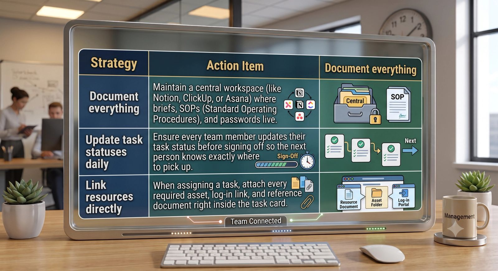

Building a global team is one of the quickest ways to scale a business, unlock around-the-clock productivity, and tap into top-tier international talent. But working across multiple time zones brings a very specific challenge: **the communication gap.** When your morning is your virtual assistant's midnight, a simple question can turn into a 24-hour delay. Left unmanaged, these gaps lead to project bottlenecks, isolated employees, and operational friction.

Overcoming this challenge doesn’t require you to pull all-nighters or force your global team to work graveyard shifts. Instead, it requires moving away from instant-response culture and embracing intentional, structured workflows. Here is how to bridge the gap and keep your cross-time-zone team completely aligned.

### 1. Shift to an "Asynchronous-First" Mindset

In a traditional office, we rely on synchronous communication—instant replies via chat, quick phone calls, or impromptu meetings. When managing a cross-time-zone team, trying to maintain this instant-response culture is a recipe for burnout.

Instead, transition to **asynchronous communication**, where team members can receive information, process it, and respond later.

- **Write with context:** Avoid sending open-ended messages like *"Hey, do you have a second?"* By the time they see it, you might be asleep. Instead, provide all necessary details, links, and goals in a single message.
- **Normalize delayed responses:** Establish clear expectations that an immediate response isn't required. A 12- to 24-hour window for non-urgent internal queries takes the pressure off global team members and improves focus.

### 2. Leverage Video Context Tools

Text-based messages can easily lose nuance and tone, leading to misunderstandings. When you need to explain a complex task, give feedback, or map out a workflow, text isn’t always the best medium.

Instead of trying to schedule a live call that inconveniences someone's evening, use screen-recording tools like **Loom**, **Vidyard**, or **Berrycast**.

> **The Loom Strategy:** Spend 3 minutes recording your screen, showing exactly what you need done, walking through the files, and explaining the logic. Your VA can watch it at 2:00 AM your time, fully grasp the instruction, and execute it perfectly without waiting for a live meeting.

### 3. Centralize Truth in Project Management Hubs

When teams operate on different schedules, a centralized project management tool isn't just optional—it’s your operational backbone. If information lives in Slack threads or scattered emails, things will fall through the cracks.

### 4. Create and Protect overlapping Windows

While asynchronous work handles 80% of your business operations, live connection still matters. Identify a small window of time where both time zones are reasonably awake and alert.

For example, if you are based in New York (EST) and your virtual assistant is based in Manila (PHT), there is a natural 12-hour difference.

- **8:00 AM EST** is **8:00 PM PHT**.
- This provides a clean, 1-to-2-hour overlapping window where you can run a quick weekly sync, answer urgent questions live, or build rapport.

Use tools like **World Time Buddy** or **Timezone.io** to easily map out your team's local times and find these golden crossover windows without making anyone jump on a call at 3:00 AM.

### Efficiency Across Borders

Managing a global, cross-time-zone team doesn't have to feel like a game of telephone. By implementing the right asynchronous structures, leveraging video recordings, and maintaining a centralized hub of truth, you can turn a potential operational headache into a competitive advantage.

When done right, your business can literally move forward while you sleep.
