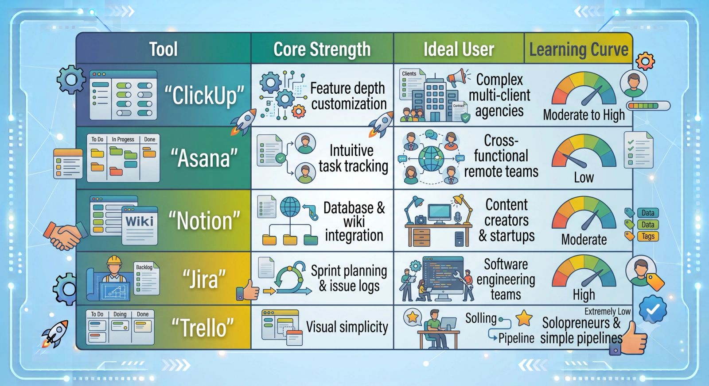

Choosing a project management tool based purely on marketing hype is the fastest way to derail your team’s productivity.

Every software out there claims to save you time, increase collaboration, and magically align your company. But the truth is, there is no single "perfect" platform. A tool that helps a fast-moving software development team ship code will completely overwhelm a creative agency trying to manage video production assets.

Over the last several years, I have audited, built out, and torn down systems across dozens of businesses. These are the **five project management tools I swear by**, broken down by exactly who they are for and where they truly shine.

### 1. ClickUp: The Ultimate All-in-One Command Center

If your primary goal is to centralize absolutely everything into a single ecosystem to cut down on your SaaS bill, ClickUp is the heavy hitter.

- **The Superpower:** Customizability. ClickUp allows you to build completely distinct spaces for different clients or internal departments. You can view the same data as a clean Kanban board, a chronological Gantt chart, a calendar view, or a basic list.
- **Best Used For:** Growing agencies, multi-faceted operational teams, and service providers managing diverse client rosters who need granular control over task dependencies and custom statuses.

### 2. Asana: The King of Clean Accountability

When your team hates overly complex software, and you just need people to execute tasks without getting bogged down by a steep learning curve, you use Asana.

- **The Superpower:** Elegant simplicity. Asana’s user interface is incredibly intuitive. It excels at clear task ownership, straightforward sub-task delegation, and setting clear, unmissable deadlines.
- **Best Used For:** Mid-sized to large remote teams, marketing departments, and companies where cross-departmental collaboration needs to happen fast and without friction.

### 3. Notion: The Flexible Knowledge Ecosystem

While Notion can technically track tasks, it isn't a traditional project manager. It is a completely blank slate that allows you to build custom internal workspaces.

- **The Superpower:** Unmatched knowledge organization. Notion connects relational databases with rich text formatting. This means your project tasks can link directly into your company’s internal wikis, standard operating procedures (SOPs), brand identity guidelines, and meeting notes.
- **Best Used For:** Solopreneurs, startups, and information-heavy businesses that want their knowledge base and high-level milestones to live in the same application.

## Quick Comparison: Finding Your Structural Fit

To help you decide which platform aligns best with your current business structure, review this high-level operational matrix:

### 4. Jira: The Technical Sprint Master

If your business builds software, manages IT infrastructure, or handles complex product development cycles, you don't want a generic task manager. You need Jira.

- **The Superpower:** Deep technical agility. Jira is custom-built for Agile and Scrum frameworks. It tracks bug reports, handles backlog grooming, monitors developer velocity charts, and structures two-week engineering sprints flawlessly.
- **Best Used For:** Software engineering, product development, and IT operations teams that need a strict, logic-driven production environment.

### 5. Trello: The Visual Pipeline Pioneer

Sometimes, complex databases and deeply nested folders are just overkill. If your work flows in a strictly linear path, Trello remains a phenomenal option.

- **The Superpower:** Pure Kanban layout. Trello is built entirely on cards moving across columns. It mimics a physical whiteboard with sticky notes perfectly.
- **Best Used For:** Managing a basic sales pipeline, tracking content moving from "Idea" to "Published," and small teams that just need a quick, scannable visual overview of progress.

## The Verdict: Match the Tool to Your Architecture

A project management tool is only as good as the system you build on top of it. Don't pick a tool just because it looks beautiful; choose it based on how your team naturally thinks and communicates.

If you need heavy data depth, choose **ClickUp**. If you want immediate team adoption, deploy **Asana**. If you want a beautifully integrated company wiki, build it in **Notion**. Pick your engine, set your governance rules, and stick to the system.
