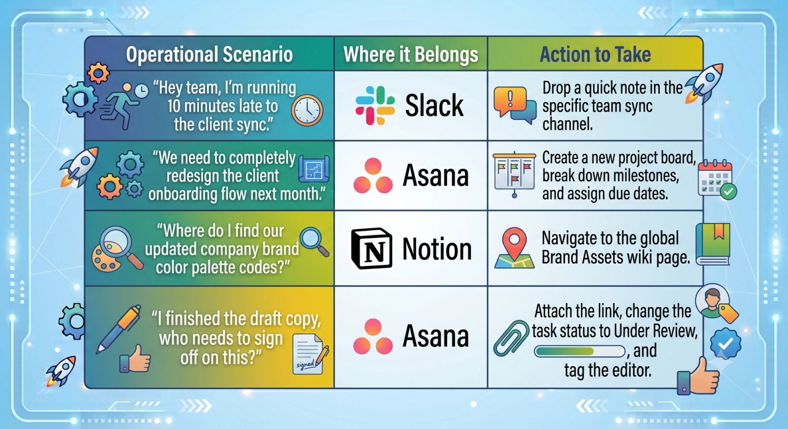

## Designing a Frictionless Remote Workspace

Most remote companies don't actually have a communication problem; they have a tool deployment problem.

They adopt Slack, Asana, and Notion because they are the industry standards. But without strict architectural rules, those tools quickly morph into a chaotic, stressful playground. Tasks get assigned inside a casual Slack chat, files get buried in Notion pages, and Asana boards sit abandoned like empty digital construction sites.

When your team doesn’t know *where* to put information, they spend more time looking for data than actually doing the work.

To build a frictionless remote company, you must treat Slack, Asana, and Notion as a single, unified ecosystem. Here is the operational blueprint to give each tool a distinct purpose and integrate them seamlessly.

### 1. The Divine Rule: Assign the Purpose

Before fixing the tech backend, you must establish clear behavioral boundaries for your team. Every tool needs a non-negotiable definition of use:

- **Slack is for Conversation (The "Now"):** This is your digital water cooler and urgent triage center. It is for real-time discussion, quick questions, and cultural connection. **Slack is not a project manager.** \* **Asana is for Accountability (The "What & When"):** If a piece of work takes longer than five minutes, requires a deadline, or needs a clear owner, it belongs exclusively in Asana. If a task isn't in Asana, it does not exist.
- **Notion is for Knowledge (The "How"):** Notion is your company’s institutional memory. It stores SOPs, brand strategy documentation, client asset libraries, and historical archives.

### 2. Eliminating the "Slack Leak"

The biggest source of remote friction is when projects get managed inside chat channels. A client feedback note drops into a channel, five team members comment on it, and the original directive is lost forever in a sea of scroll.

- **The Fix:** Implement the **Asana Shortcut Rule**. Teach your team to use Slack’s built-in shortcuts or app integrations to turn messages into Asana tasks instantly.

> **The Flow:** A client asks for a graphic modification in Slack $\rightarrow$ Click the message options $\rightarrow$ Select "Create Task in Asana" $\rightarrow$ Assign the designer and add a due date.

The conversation stays in Slack, but the accountability is safely logged in Asana.

### 3. Deep Linking Asana to Notion

Your task management system should never be completely separated from your knowledge base. If an Asana task instructs a team member to "Publish the Weekly Blog Post," they shouldn't have to open a new tab and spend ten minutes hunting through Notion to find the correct checklist.

- **The Fix:** Embed Notion links directly into Asana task descriptions or project templates.
- When building an Asana project template, pre-populate the task description fields with direct hyperlinks to the exact Notion SOP required to complete that task. This creates an elegant click-through loop that eliminates operational friction.

## The Remote Workspace Tool Governance Matrix

To ensure your team maintains clean operational hygiene across your systems, print out or pin this simple governance matrix inside your onboarding center:

### 4. Enforcing the Asana Checklist Rule

To keep your Asana project boards exceptionally clean and readable, do not write out step-by-step technical guides inside task comments. That creates visual clutter.

Instead, keep the Asana task clean: just the deadline, the owner, and a high-level summary. Then, embed a single link to the comprehensive Notion SOP. Asana tracks the *progress*, while Notion governs the *quality*.

## Systemic Peace of Mind

Friction in a remote workspace isn't inevitable; it is an organizational choice. By giving Slack, Asana, and Notion clear, distinct roles—and building simple bridges between them—you eliminate digital noise, protect your team's focus, and build a structured operational machine that runs smoothly across time zones.
