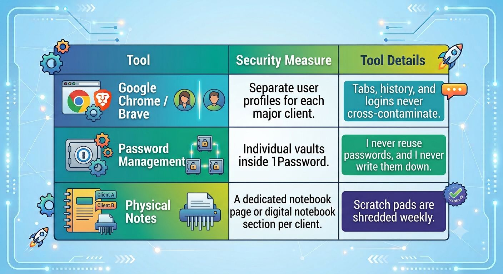

It’s Sunday morning, the office is quiet, and I have a warm mug of coffee in my hand. This is usually the time I use to reflect on the deeper, less talked-about foundations of running a service-based business. Today, my mind keeps coming back to a single word: **Trust.**

When a client hires you—whether you are a consultant, a virtual assistant, a designer, or a strategist—they aren't just paying for your skills. They are handing over the keys to their kingdom. They show you their messy back-end systems, their fluctuating financials, their proprietary ideas, and their half-baked strategies.

Non-Disclosure Agreements (NDAs) are great legal safety nets, but true confidentiality isn't just a legal obligation. It’s a professional ethos.

Over the years, I've developed a strict, personal operational framework to ensure that my clients' sensitive information stays exactly where it belongs—secure and private. Here is how I protect the people who trust me with their business data.

### 1. The Principle of Zero Digital Footprints

It is incredibly easy to get sloppy with data when you are moving fast. You take a quick screenshot of a client's analytics dashboard to analyze later, or you download a CSV file of their customer list to your desktop. Suddenly, sensitive data is scattered across your personal hardware.

- **My Rule:** **Zero local downloads.** I treat my personal computer like a viewing terminal, not a storage unit.
- Everything stays inside secure, cloud-based environments (like Google Drive or Notion) owned by the client, wherever possible.
- If I must download a file to work on it, it goes into an encrypted, temporary folder and is permanently deleted the moment the task is complete.

### 2. The One-Client, One-Workspace Rule

When you are juggling multiple clients, cross-contamination is your biggest enemy. Mixing up tabs or accidentally sharing an idea from Client A with Client B during a brainstorming session can ruin a professional relationship instantly.

- **My Rule:** **Hard compartmentalization.** I use separate browser profiles for different projects.

### 3. Digital Hygiene in Public and Private Spaces

As remote work has grown, so have the risks of accidental exposure. Working from a coffee shop sounds idyllic until someone glances over your shoulder and reads a proprietary strategy document on your open laptop.

- **My Rule:** **Strict environmental awareness.** \* I use a physical **privacy screen protector** on my laptop that blocks side-angle viewing.
- I never log onto public Wi-Fi without a robust, active VPN.
- When I step away from my desk—even at home—I hit `Win + L` (or `Cmd + Ctrl + Q` on Mac) to lock my screen immediately. My family loves me, but they don't need to see my clients' private operations.

### 4. Anonymity in General Conversation

We all love to talk about our wins, share case studies, or vent about a tricky business problem with our peers. But telling a story that contains just enough specific detail for someone to guess the client's identity is a massive breach of trust.

- **My Rule:** **Aggressive abstraction.** When I share case studies publicly or discuss business problems with masterminds, I scrub all identifying features. Instead of saying, *"My e-commerce client who sells eco-friendly shoes in Austin is doing X,"* I say, *"A mid-sized retail brand is experiencing X."* If the story can be traced back, the story shouldn't be told.

### 5. Intentional Offboarding

True confidentiality extends far beyond the end of a contract. When an engagement ends, it's easy to just walk away and leave old folders sitting in your cloud storage.

- **My Rule:** **The Clean Break.** Part of my offboarding process includes a thorough digital sweep. I revoke my own access to their tools, ask them to change shared passwords, and completely delete any temporary operational files I held.

## The Ultimate ROI of Integrity

Building a reputation for ironclad confidentiality takes time, effort, and a bit of daily discipline. It means pausing to log into a password manager instead of taking a shortcut. It means investing in the right security tools.

But the peace of mind it gives your clients is priceless. When people know their secrets, data, and vulnerabilities are completely safe with you, they don’t just stay clients for life—they become your fiercest advocates.

How do you keep your workflows locked down? Have a peaceful Sunday, and let's get ready for a secure, productive week ahead.
