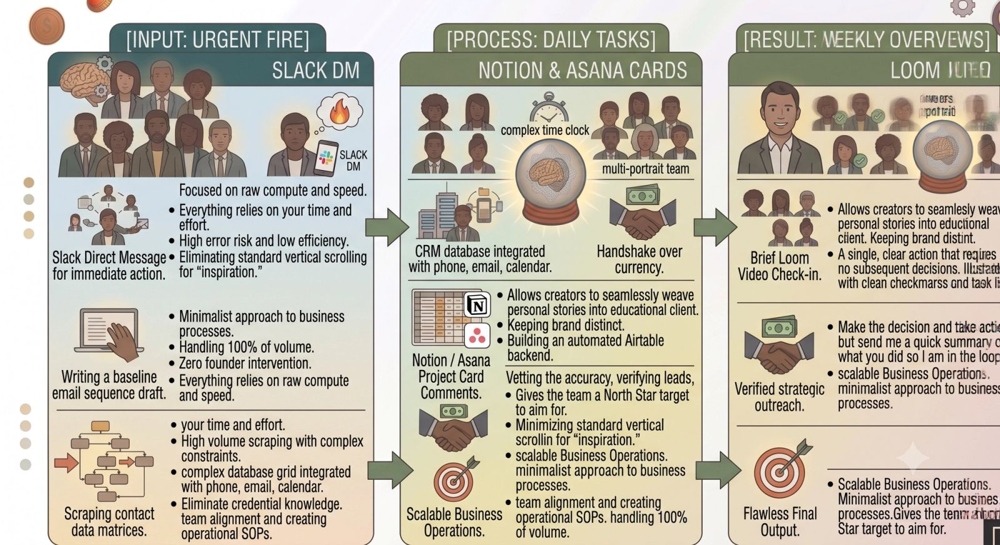
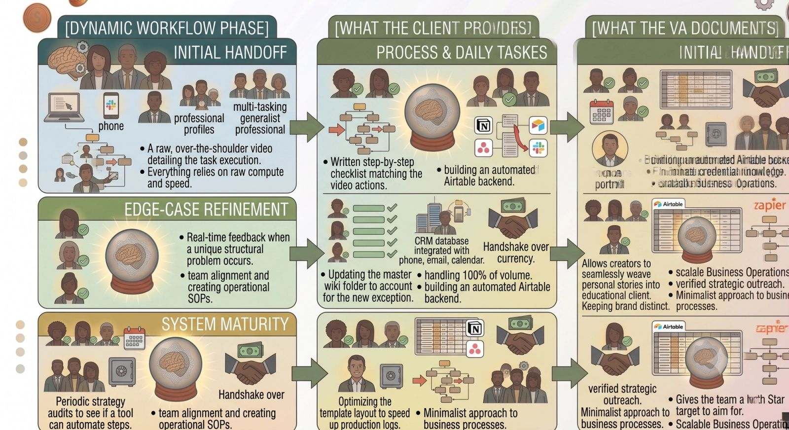

Hiring a Virtual Assistant (VA) is a thrilling milestone for any business leader. It signals that your business is growing and that you are ready to transition from a solo operator to a true executive.

Yet, many founders stumble into the relationship with zero strategy, expecting the VA to read their minds and fix their business magically overnight. When miscommunications happen, the founder frequently blames the assistant, cuts ties, and falsely concludes, *"It's just faster if I do it myself."*

High-leverage delegation isn’t a matter of luck; it’s a matter of **systems**.

To build an elite, frictionless partnership that lasts for years and frees up dozens of your hours every single week, you must treat these ten operational rules as absolute law.

### I. Clarity is Kindness

Never give vague, one-sentence instructions like, *"Can you clean up our CRM?"* A general directive invites guesswork and guarantees a disappointing result. Instead, provide absolute context: what the final asset looks like, where the data should live, and exactly what choices to make when encountering edge cases.

### II. Thou Shalt Record screen-shares

The fastest way to train a remote operator is to record your screen while actually doing the task yourself. Use tools like Loom or CleanShot to walk through a workflow live. Talk through your decision-making out loud, save the link into a central directory, and let the recording do the heavy lifting of training for you.

### III. Systematize Communication Channels

Do not scatter your communication across email, WhatsApp, Slack, and text messages. This creates anxiety and ensures critical details drop through the digital cracks. Define a rigid communication structure:

### IV. Embrace Asynchronicity

Stop demanding real-time responses for every minor thought that pops into your head. Forcing a remote partner to sit inside a live chat window all day destroys their deep-work focus. Move your management to asynchronous updates, allowing them the quiet time needed to build backend systems and execute high-quality work.

### V. Define Key Results, Not Just Hours Logged

Elite leaders do not pay for raw hours spent sitting in a chair; they pay for **business outcomes**. Shift your evaluation metrics from time cards to trackable key results. Instead of measuring if they worked 20 hours this week, measure if they successfully verified 200 leads or resolved every open customer support ticket within our standard 4-hour window.

### VI. Document Everything (Build SOPs)

Every single time your assistant masterfully solves a recurring business problem or builds a new workspace workflow, require them to document it as a **Standard Operating Procedure (SOP)**. If your processes live only inside your assistant's head, you have built a fragile operational bottleneck. Turn their knowledge into a permanent organizational library.

### VII. Empower with Trust (Do Not Micromanage)

If you log into your shared dashboard every 30 minutes to check if your assistant is typing, you are wasting the very time you hired them to save. Once a workflow is trained and documented, step back. Give your operator the ownership, credentials, and systemic authority to make execution calls without needing your micro-approval.

### VIII. Establish a Strict No-"Ghosting" Policy

In a remote working relationship, communication visibility is the equivalent of physical presence. A missed deadline is manageable if it is communicated early; radio silence is completely unacceptable. Establish a mutual agreement that if a project hits an unexpected roadblock, a proactive alert must be flagged immediately.

### IX. Invest in Continuous Upskilling

Your business ecosystem is evolving rapidly. To keep your virtual partner operating at an elite level, you must actively invest in their technical education. Buy them that specialized automation course, send them advanced platform tutorials, and give them paid business hours to master the new AI tools hitting the market.

### X. Review, Refine, and Calibrate Monthly

A successful partnership requires continuous open loops of feedback. Set aside 30 minutes at the end of every month exclusively to evaluate the operational engine. Ask candidly: *Where are we experiencing communication friction? What software bottlenecks slowed us down this month? What can we offload next?*

> **The Golden Rule of Delegation:** Your virtual assistant's performance is a direct reflection of your leadership clarity, your training systems, and the operational boundaries you establish.

### The Bottom Line

A world-class virtual assistant relationship can easily double a founder's creative productivity and output. By committing to these ten structural commandments, you move past the chaotic world of frantic, short-term task-delegation and step into a highly organized, highly lucrative operational partnership designed to scale your business seamlessly.
