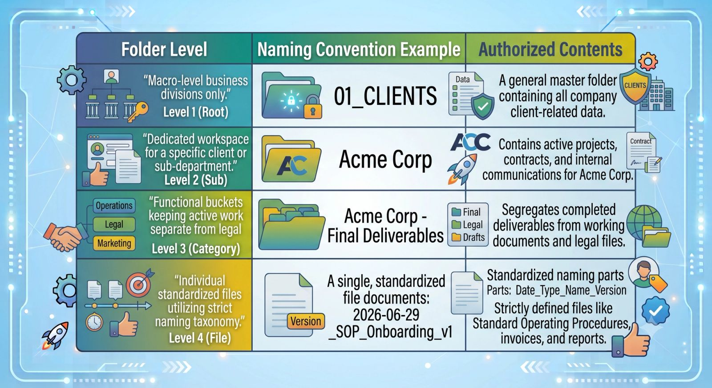

We have all been there. You need to find a client’s updated contract, an onboarding asset, or a specific design file, so you open Google Drive and type a keyword into the search bar.

What happens next is pure chaos. You are met with a wall of duplicates: `Proposal\_v2`, `Proposal\_FINAL`, `Proposal\_FINAL\_EDITED\_v3`, and worst of all, twenty documents titled `Untitled document`.

When your company's cloud storage looks like a digital landfill, your team wastes hours hunting for assets, old versions get sent to clients by mistake, and operational momentum grinds to a halt.

You cannot rely on a search bar to save you. You need a strict, predictable system. Here is the operational framework I use to permanently eliminate Google Drive clutter and design an intuitive, self-sustaining folder architecture.

### Step 1: The Master Root Directory

The fastest way to break a file system is to have too many folders at the top level. When someone opens your shared drive, they should see a clean, minimalist launchpad—not a sprawling list of fifty random folders.

Limit your root directory to a maximum of **6 to 8 master folders**, and use numerical prefixes to force them into a logical sequence rather than letting alphabetical order dictate the layout:

- **`01\_CLIENTS`****:** Active client workspaces, deliverables, and communication logs.
- **`02\_OPERATIONS`****:** Internal team rosters, software logins, SOPs, and company wikis.
- **`03\_MARKETING`****:** Brand assets, social media scheduling templates, graphics, and content drafts.
- **`04\_FINANCE`****:** Invoices, tax documents, bank statements, and payroll sheets.
- **`05\_LEGAL`****:** Master service agreements, NDAs, corporate registries, and insurance policies.
- **`99\_ARCHIVE`****:** The dead-storage vault for churned clients or ancient projects you want out of sight but cannot delete.

### Step 2: Establish the Golden Internal Checklist

Inside every single client folder, consistency is king. If `Client A` has a folder structure that looks completely different from `Client B`Your team will lose their minds every time they switch accounts.

Create a **Master Client Template Folder** inside your system. Every time you onboard a new partner, duplicate this exact layout:

1. **`[Client Name] - Contracts & Briefs`**
2. **`[Client Name] - Brand Assets & Context`**
3. **`[Client Name] - Raw Materials / Uploads`**
4. **`[Client Name] - Final Deliverables`**

By keeping this sub-structure uniform across your entire enterprise, anyone on your team can jump into any client account and immediately find exactly what they need in less than five seconds.

## The Standardized File Architecture Blueprint

To ensure your workspace remains clean, map out your corporate folder rules using this clear structural hierarchy:

### Step 3: Implement Strict Naming Taxonomies

A clean folder structure is completely useless if the files inside it are named chaotically. To stop version control nightmares, enforce a company-wide naming taxonomy.

Every file uploaded to your drive should follow this exact sequence:

$$\text{[YYYY-MM-DD]} \\_ \text{[Project/Client Name]} \\_ \text{[Document Type]} \\_ \text{[Version]}$$

- **Bad Name:** `new onboarding doc updated.pdf`
- **Good Name:** `2026-06-29\_SOP\_Onboarding\_v1.pdf`

> **Why this works:** Starting your file names with the year, month, and day forces Google Drive to automatically sort your documents in perfect chronological order when viewed alphabetically. This completely eliminates the guessing game of which file is the most recent.

### Step 4: The "Read-Only" Asset Vault

One of the biggest security risks in Google Drive is accidental editing. A team member or client opens a vital master template, makes direct modifications to it instead of making a copy, and ruins the resource for everyone else.

- **The Fix:** Protect your assets by setting strict permission boundaries. Your master assets, brand identity guidelines, and template files should live in a locked folder where only administrators have **Editor** privileges. Everyone else on the team should be set to **Viewer**. If they need to use a template, they must go to `File` $\rightarrow$ `Make a copy` to generate their own workspace.

## Reclaiming Operational Sanity

Digital clutter is an invisible tax on your team's mental focus. By taking an afternoon to wipe out loose files, establish a bulletproof root directory, and enforce standard naming protocols, you turn Google Drive from a stressful labyrinth into a highly efficient operational engine. Stop hunting for files—build a system that does the heavy lifting for you.
