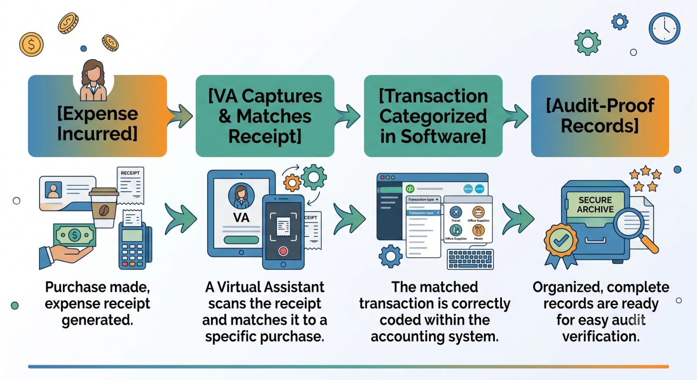
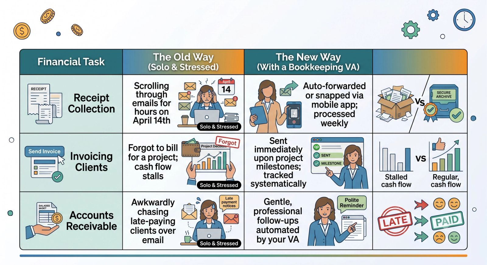

For most business owners, the scariest phrase in the English language isn't "we have a bug in production" or "our competitor lowered their prices." It’s **"You are being audited."**

Tax season or an unexpected financial audit can trigger a wave of panic, especially if your financial management strategy consists of a shoebox stuffed with crumpled receipts and a disorganized inbox of digital invoices.

But clean books don't require you to sacrifice your weekends to spreadsheets. By partnering with a **Bookkeeping Virtual Assistant (VA)**, you can transform your messy financial trail into a streamlined, audit-ready asset.

## What Does "Audit-Ready" Actually Mean?

Being audit-ready means that if a tax authority or investor asks for documentation backing up any transaction on your tax returns or profit-and-loss (P&L) statements, you can produce it in under 60 seconds.

A bookkeeping VA ensures that your business operates with this exact level of clarity every single day, rather than scrambling at the end of the fiscal year.

## 3 Core Ways a Bookkeeping VA Protects Your Bottom Line

### 1. Real-Time Receipt and Invoice Matching

It’s easy to forget what a random $47 transaction from three months ago was for. A bookkeeping VA establishes a daily or weekly routine to capture receipts from tools like Dext, Hubdoc, or a dedicated email inbox. They instantly match those receipts to corresponding bank and credit card transactions within your accounting software (like QuickBooks Online or Xero).

### 2. Standardized Expense Categorization

Incorrectly classifying expenses is one of the fastest ways to trigger an audit or miss out on massive tax write-offs. A specialized VA learns your business model and accurately tags transactions based on standard accounting rules:

- Distinguishing between software subscriptions and hardware assets.
- Correctly categorizing client entertainment versus internal team meals.
- Ensuring personal expenses never accidentally cross over into business accounts.

### 3. Maintaining the Digital Document Archive

Gone are the days of keeping physical filing cabinets. A bookkeeping VA builds a secure, cloud-based filing system (using Google Drive, Dropbox, or your accounting software's native storage) organized by fiscal year, month, and expense category. Every invoice is clearly named, making it incredibly simple to search and export if needed.

## The Workflow Blueprint: Solo vs. With a Bookkeeping VA

> **The Cost of Disorganization:** When your books are messy, your CPA has to spend hours cleaning them up before they can even file your taxes. Since CPAs charge premium hourly rates, hiring a bookkeeping VA to maintain your records weekly can save you thousands of dollars in annual accounting fees.

## Peace of Mind is Only a Delegation Away

Clean books give you more than just protection against audits; they give you accurate data to make smart business decisions. When you know exactly where your cash flow stands, you can hire with confidence, invest in marketing, and scale sustainably.

Stop dreading your finances. Bring on a bookkeeping virtual assistant and buy back your peace of mind.
