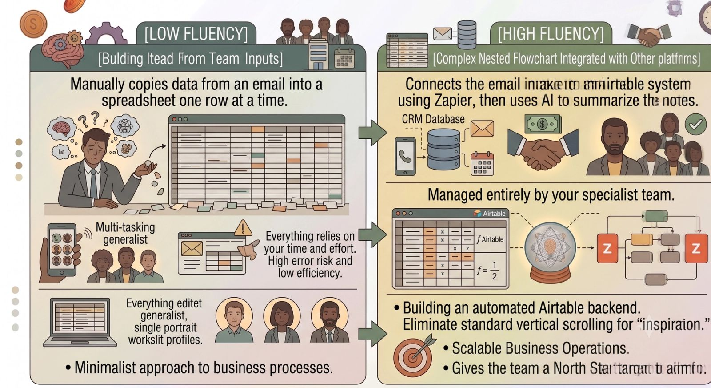
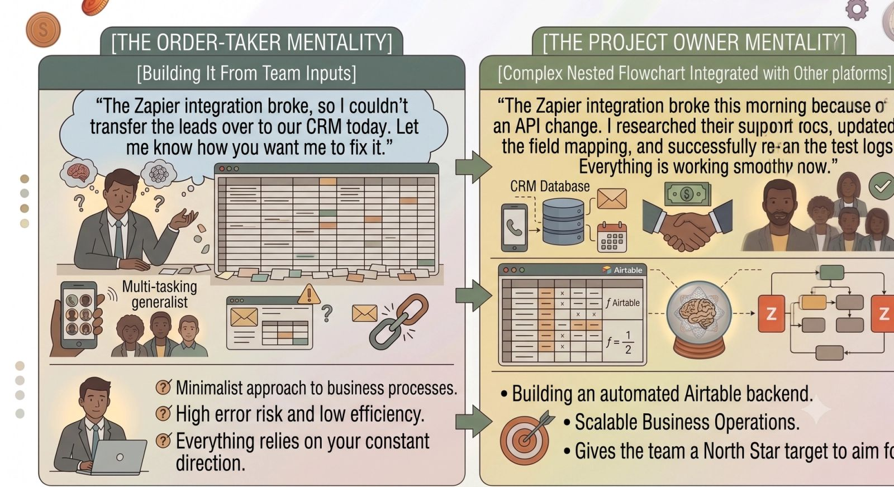

The traditional remote hiring checklist is officially obsolete.

For years, founders evaluating virtual assistants or remote project managers looked for basic, static qualities: *Are they organized? Can they answer emails quickly? Do they have a reliable internet connection?*

But as workplaces become heavily decentralized, automated, and tech-driven, those baseline traits no longer cut it. Today's scaling businesses don't just need task-checkers; they need dynamic operators who can step into a digital ecosystem and drive real leverage.

If you want to build a self-sustaining business that doesn't constantly pull you back into the weeds, your hiring criteria must evolve. Here are the four non-negotiable core skills future leaders must screen for when recruiting remote help.

### 1. High Tech Fluency & AI Orchestration

You should no longer hire remote talent that requires step-by-step training on how to use modern software. Instead, you want to hire people who actively look for ways to optimize your software stack.

The modern remote operator must possess a deep comfort level with cloud infrastructure, project management systems, and generative tools. They don't need to be computer programmers, but they do need to know how to connect platforms to maximize efficiency.

- **How to Screen for This:** During the interview process, ask: *"What AI tools do you use in your daily workflow to speed up your output, and how do you handle cross-platform data management between apps like Notion, Slack, or Zapier?"*

### 2. Radical Asynchronous Communication

In a distributed workspace spanning multiple cities or time zones, waiting around for real-time meetings is a silent killer of operational momentum. Real scale happens when a team can push projects forward without needing to sync up live on Zoom every single day.

Exceptional remote hires are masters of **asynchronous clarity**. They know exactly how to structure an update so that the recipient has 100% of the context required to make a decision immediately.

- **The Markers of Async Mastery:**
  - They write highly scannable, bulleted status updates instead of dense paragraphs of text.
  - They proactively attach brief Loom or CleanShot screen-share videos to visually walk through complex technical issues or layout problems.
  - They always include clear call-outs indicating who owns the next action item and what the specific deadline is.

### 3. Absolute Project Ownership (The "Figure-It-Out" Factor)

There are two categories of remote workers: those who wait around to be told exactly what to do next, and those who look at an end goal and map out their own path to get there. To step out of the day-to-day operations desk, you desperately need the latter.

Future leaders must prioritize candidates who possess strong critical thinking skills and high risk tolerance for problem-solving. When a high-leverage operator encounters a software bug or an unexpected hurdle, their first instinct isn't to message you asking for a solution. They research documentation, test fixes, and present you with answers.

### 4. Digital Documentation & SOP Architecture

The true value of an elite remote hire isn't just the work they produce; it’s the lasting operational infrastructure they leave behind inside your organization.

If a remote assistant builds a brilliant new system for tracking your social media analytics but keeps the entire process locked inside their head, they have created an operational bottleneck. True leverage means every single recurring process is standardized into an accessible **Standard Operating Procedure (SOP)** library.

- **What to Look For:** Look for professionals who treat process documentation as a mandatory final step for every task they complete. They should naturally build clean templates, map out logical step-by-step workflows, and maintain your internal wiki (like Notion or ClickUp) without being nudged.

### The Bottom Line

You cannot build a forward-thinking, automated company if you are anchoring your hiring strategies to old legacy mentalities.

Stop looking for data-entry clerk resumes. Start searching for tech-fluent, self-directed systems architects who communicate flawlessly over text and video, protect your calendar fiercely, and view their primary responsibility as building and maintaining the infrastructure that drives top-line revenue growth.
