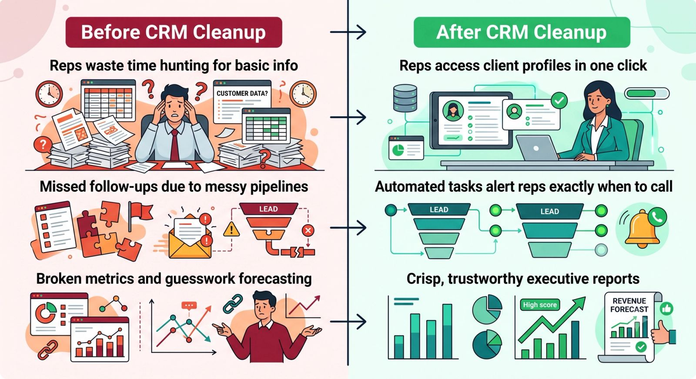

Data is the lifeblood of modern business. It tells you who your customers are, what they buy, and when your sales team should follow up.

But when that data becomes a chaotic web of duplicate contacts, missing phone numbers, and outdated pipeline statuses, it transforms from an asset into an expensive liability.

"Dirty data" isn't just an annoying organizational issue—it has a direct impact on your company's bottom line. Here is exactly what messy data is costing your business, and how a dedicated CRM Virtual Assistant (VA) can fix it.

## The Hidden Costs of Messy CRM Data

Most business owners underestimate the financial leak caused by a disorganized CRM. Here are the three main ways messy data drains your resources:

- **Wasted Sales Hours:** If your sales reps spend 20 minutes digging through messy records just to find a client’s correct email address or purchase history, they aren't selling. You are paying high commissions for data entry tracking.
- **Skewed Analytics and Reporting:** You cannot make smart, strategic choices if your dashboards are lying to you. Duplicate opportunities or unassigned leads skew your conversion metrics and revenue forecasts.
- **Ruined Customer Experiences:** There is nothing more embarrassing than sending a marketing email addressed to *"First\_Name"* or having two different reps call the same prospect on the same day because the account history wasn't updated.

## How a CRM VA Cleans Up the Mess

You shouldn't be spending your weekends cleaning spreadsheets, and your top-tier sales reps shouldn't be doing it either. A CRM Virtual Assistant specializes in database hygiene, turning your CRM back into a finely-tuned machine.

### 1. Merging Duplicates and Purging Ghost Leads

A CRM VA will systematically run deduplication routines. They will merge overlapping accounts, standardise contact formatting, and archive dead leads that are needlessly bloating your software subscription costs.

### 2. Enforcing Data Standards and Pipelines

Messy data happens because there are no rules. A CRM VA establishes and maintains strict data entry standards. They will ensure that every new lead has a required phone number, industry tag, and lead source, keeping your pipelines uniform and clean.

### 3. Integrating Tools and Automating Workflows

Often, data gets messy because your website forms, email marketing tools, and CRM don't communicate properly. A VA can manage the technical backend—using tools like Zapier—to ensure data flows seamlessly from one app to another without human error.

## The ROI of Clean Data

When a CRM VA cleans up your system, the impact is felt immediately across the entire organization:

### Stop Paying for Chaos

If your CRM feels like a digital junk drawer, it is actively costing you money. Hiring a CRM Virtual Assistant is the fastest, most cost-effective way to delegate the headache of data management, protect your brand's reputation, and give your sales team the exact tools they need to win.
