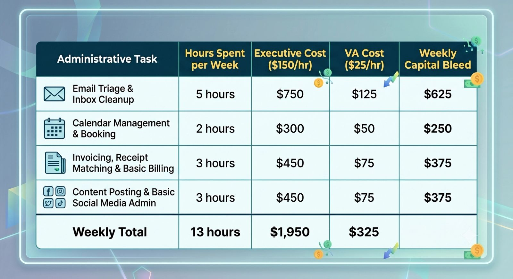

"If I want it done right, I’ll just do it myself."

It’s the ultimate founder’s mantra. In the early days of your business, this DIY mindset was your superpower. It saved you cash when capital was tight and forced you to learn the ropes of your own operations.

But as your business grows, that same mindset morphs from a money-saver into a massive financial drain.

Many entrepreneurs believe that doing their own scheduling, sorting their own inboxes, and handling their own invoicing is "free" because they aren't paying an external employee to do it. But that is a dangerous illusion. Let's look at the math behind the DIY mindset and calculate exactly how much money you are losing on admin tasks every single week.

## The Concept of Opportunity Cost

In economics, **opportunity cost** is the loss of potential gain from other alternatives when one alternative is chosen.

When you spend an hour data-cleaning your CRM, the true cost isn't $0. The true cost is the value of whatever else you *could* have been doing with that hour. If you weren't doing admin, you could have been closing a deal, refining your product, or building a high-impact marketing strategy.

> **The Reality Check:** You are always paying someone to do your administrative work. If you don't hire an assistant to do it, **you** are the assistant. The only difference is that you are paying yourself an executive salary to do entry-level work.

## Let’s Do the Math: Your True Hourly Value

To understand how much money you are losing, you first need to calculate your **True Hourly Value (THV)** to the business. This isn't just your take-home pay; it’s the revenue-generating power of your time.

Let’s look at a realistic scenario for a scaling business owner:

- **Target Annual Business Revenue:** $300,000
- **Hours Worked per Year:** Approx. 2,000 (40 hours/week $\times$ 50 weeks)
- **Your True Hourly Value:** **$150 / hour**

Now, let's track a typical "DIY" week where you handle your own administrative tasks:

### The Annual Bleed:

By spending 13 hours a week on tasks that a Virtual Assistant could handle seamlessly, you aren't saving money. You are burning **$1,625 every single week** in lost high-value output.

Over a 50-week work year, that adds up to **$81,250 in hidden administrative costs.**

## The Compounding Cost: Growth Bottlenecks

The financial drain isn't just limited to the hours lost; it also stunts your company's growth velocity. When you are buried under administrative friction, your business suffers from three distinct compounding penalties:

### 1. The Energy Penalty

Context-switching kills focus. If you are interrupted by a flurry of scheduling emails while trying to write a critical sales proposal, it takes an average of 23 minutes to refocus on your deep work. Admin work fragments your day, leaving you too exhausted to make high-level strategic pivots.

### 2. The Relationship Penalty

While you are busy dealing with software errors or resetting passwords, your VIP clients and high-value leads are waiting for a response. Delayed follow-ups translate directly into dropped contracts and lost lifetime value.

### 3. The Scalability Cap

A business cannot scale beyond the capacity of its leader. If you are maxed out at 50 hours a week because half your time is consumed by operations, your business has officially hit its revenue ceiling. You literally do not have the physical time to accept more clients.

## How to Stop the Bleed

Breaking the DIY cycle requires a psychological shift from *saving pennies* to *leveraging time*.

1. **Audit Your Week:** For the next 5 working days, keep a notepad next to your keyboard. Write down every single task you do that doesn't directly generate revenue.
2. **Calculate the ROI of Delegation:** Hiring a competent VA for 15 hours a week at $25/hour costs you $375. If freeing up those 15 hours allows you to close just *one* new client or partnership worth more than $375, you are immediately operating at a profit.
3. **Build a "Stop-Doing" List:** Hand your audit list directly to your new VA. Train them once, create a standard operating procedure (SOP), and step away.

Stop paying executive prices for coordinator results. Reclaim your hours, protect your bottom line, and hand the admin over to a professional.
