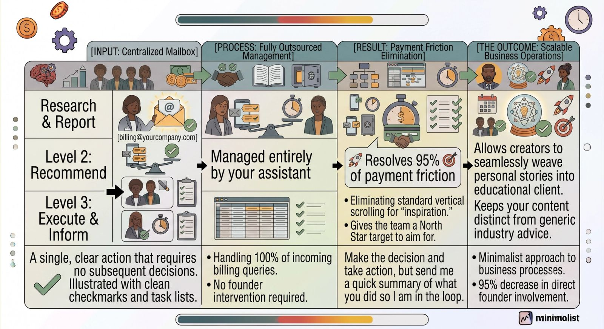
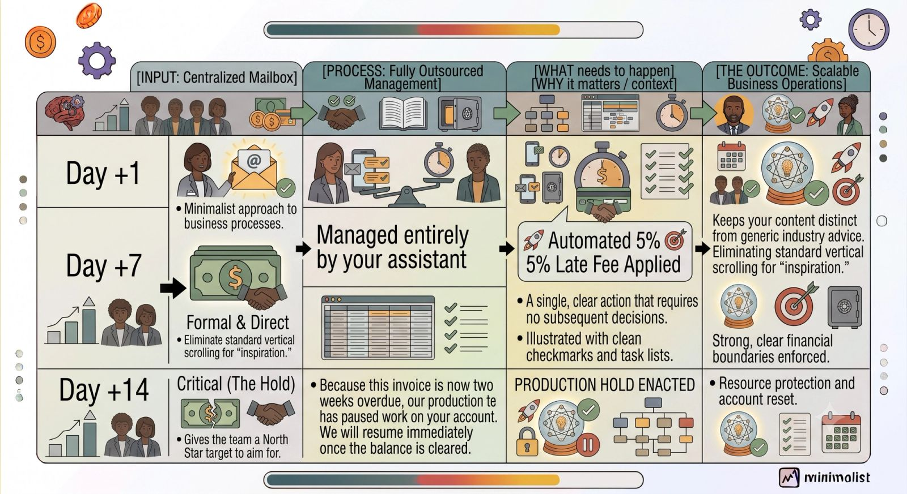

There is nothing more satisfying than closing a new client or sealing a major deal. But there is nothing more draining than the administrative paperwork that follows—or worse, spending your Friday afternoons sending awkward, passive-aggressive emails to clients whose invoices are 30 days overdue.

As a founder, managing accounts receivable is an absolute momentum killer. It drags you out of growth mode and forces you into the role of an administrative debt collector.

The paradox? You can't just stop doing it. Cash flow is the lifeblood of your business.

The solution is to offload the invoicing and collections engine to an operations manager, virtual assistant, or fractional bookkeeper. By building a strict, policy-driven workflow, you can step away from the collections conversations entirely while keeping your cash flow completely protected. Here is your step-by-step playbook to hand off the billing keys safely.

### Phase 1: Establish Your "Frictionless Billing" Architecture

You cannot hand off a chaotic process. If your invoicing method currently consists of you remembering to open QuickBooks or FreshBooks at the end of the month, your assistant will fail.

Before outsourcing, you must formalize your standard billing rules into a documentation matrix:

- **The Trigger System:** Define exactly *when* an invoice is generated. Is it immediately upon signing a contract? Is it a recurring monthly retainer billed on the 1st? Is it milestone-based?
- **Payment Thresholds:** Establish standard terms. Do you operate on Net 0 (due upon receipt), Net 15, or Net 30?
- **The Grace Period Policy:** Define the exact timeline for late fees. Do you apply a 5% penalty on day 5 or day 10?

Documenting these parameters transforms invoicing from a series of subjective, emotional decisions into a predictable, logical process that any operations assistant can execute.

### Phase 2: Separate the Founder from the "Bad Cop"

The biggest hurdle founders face with collections is emotional friction. You have built a close, trusting relationship with your client; you don't want to jeopardize that relationship by hounding them for $5,000.

To bypass this completely, **remove your name from the billing inbox.**

1. **Create a Dedicated Alias:** Set up a shared email account specifically for finances (e.g., `billing@yourcompany.com` or `finance@yourcompany.com`).
2. **Introduce the Team:** When onboarding a client, explicitly state: *"For all strategy and project deliverables, you’ll talk directly to me. For all contract, receipt, and invoice inquiries, our finance team at billing@yourcompany.com will take care of you."*
3. **The Assistant Blame Shift:** If a client brings up a billing issue to you via text or a regular email thread, pass it off immediately: *"Hey John, I want to make sure this gets sorted instantly. I’ve looped in my finance team here, and they will get that invoice updated for you right away."*

By creating this operational buffer, your assistant handles the accounting math, allowing you to maintain an untarnished relationship focused purely on client success.

### Phase 3: Build the Automated Dunning Escalation Sequence

Do not let your assistant write custom, ad hoc reminder emails every time an invoice goes unpaid. Instead, map out a strict **Dunning Sequence Template Library**.

Your assistant should follow an automated, calendar-driven schedule for past-due accounts:

Because the templates and dates are locked in, your assistant never has to guess what to say or feel anxious about hitting send. They are simply executing the system.

### Phase 4: Create a High-Level Oversight Protocol

Offloading the process does not mean abdication. You still need ultimate visibility into the financial health of the business.

To maintain total control without dipping your toes back into the day-to-day admin, establish a **10-Minute Weekly Accounts Receivable (AR) Review**.

Every Monday morning, your assistant sends you a brief dashboard summary containing three metrics:

1. **Total Invoiced:** The gross dollar amount sent out during the previous week.
2. **Total Collected:** Cash physically received.
3. **The Aged AR Report:** A simple list of any outstanding invoices sitting in the 15+, 30+, or 60+ days categories, alongside a one-sentence note detailing the latest outreach status.

### The Bottom Line

Chasing money is a poor use of a founder's hourly value. By building a clear billing system, deploying a dedicated financial email alias, and setting automated dunning guardrails, you can successfully step away from the bookkeeping desk.

Your cash flow will become more predictable, late payments will drop, and you can focus your mental energy entirely on driving top-line revenue.
