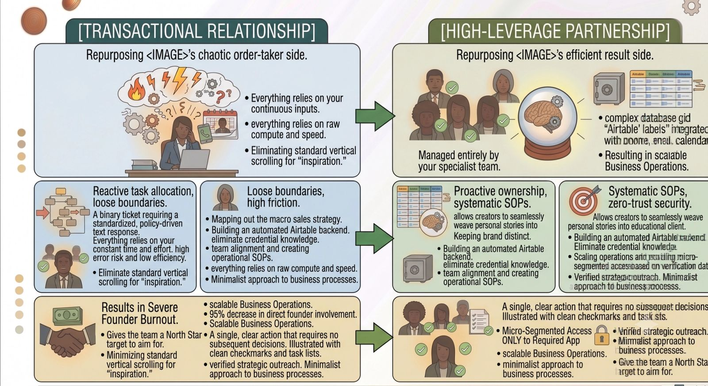
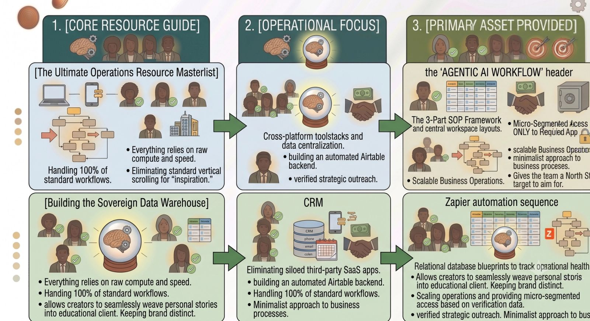

Building a high-leverage company isn't about working more hours; it’s about optimizing the infrastructure behind the hours you already have.

If you are a founder or an operator drowning in administrative noise, micro-tasks, and reactive calendar management, you don't need another generic motivational quote. You need clean systems, strict communication boundaries, and a scalable delegation playbook.

To help you eliminate operational friction and scale your team seamlessly, we have curated our most impactful, strategic guides into one centralized master index. Bookmark this page as your ultimate operational reference guide.

### Pillar 1: Mastering the Client-VA Partnership

A virtual assistant isn't a temporary band-aid for your inbox; they are an extension of your operational infrastructure. These foundational guides break down how to transition from a chaotic, transactional relationship into an elite, high-leverage partnership.

- **[The 10 Commandments of a Successful Client-VA Partnership]:** Discover the 10 core laws governing communication, software permissions, and workflow tracking that distinguish world-class delegation from painful operational failure.
- **[60-Day Challenge Reflection: How Focus Transformed My Own VA Practice]:** A behind-the-scenes look at the exact boundaries, calendar frameworks, and single-tasking constraints I deployed to drop my administrative overhead by 55%.

### Pillar 2: Systems, Templates, and Asset Vaults

Processes are only as good as the software databases housing them. If your standard procedures exist as unorganized blocks of text scattered across various Google Docs, your team won't use them. These resources provide ready-to-use blueprints to organize your corporate engine.

### Pillar 3: Future Trends and Strategic Alignment

Operational strategies are shifting fast. The playbooks that carried companies through the early 2020s are officially hitting their expiration dates. To remain highly competitive, your systems must anticipate tomorrow's tech landscape.

- **[5 Operations Trends Founders Need to Prepare for Next Year]:** This essential forward-looking guide breaks down the massive shift from basic automated triggers to agentic AI workflows, hyper-asynchronous cultures, and fractional executive infrastructure.
- **[The Micro-Segmented Zero-Trust Guide]:** How to harden your decentralized remote work perimeter using masked credential vaults and strict cloud container parameters without slow-rolling team execution velocity.

### Pillar 4: The Founder's Psychology

You can buy the best software tools and build the most comprehensive SOP libraries in the world, but if your ego refuses to actually let go of the steering wheel, your company will remain entirely bottlenecked by you.

- **[A Letter to Overwhelmed Founders: It's Okay to Ask for Help]:** A raw, honest reality check written for the founder working late into the evening. Learn how to dismantle the "solo hero" myth and structurally redefine delegation as an act of absolute executive maturity.

### How to Use This Master Index

Don't attempt to implement all of these systems simultaneously tomorrow morning—that is a fast track to operational paralysis. Instead, pick your highest-friction bottleneck right now:

1. If your calendar is a mess, start with **The 10 Commandments of a Client-VA Partnership**.
2. If your team lacks structure, open **The Ultimate Operations Resource Masterlist** and copy our SOP framework.
3. If you are on the verge of burnout, read **A Letter to Overwhelmed Founders** tonight.

Your operational strategy *is* your competitive strategy. Pick one guide, deploy the boundaries, and start building your high-leverage machine today.
