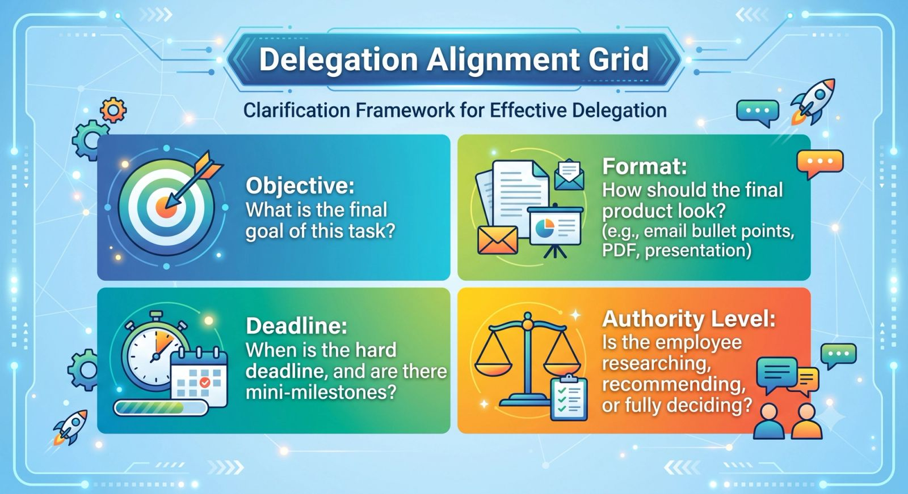

Every growing business reaches a tipping point where the founder can no longer do everything alone. You know you need to delegate, so you start handing off tasks. But instead of feeling relieved, you find yourself working longer hours, correcting mistakes, and wondering why nobody can do the job quite like you.

The truth? The problem usually isn’t the team—it’s how the tasks are being delegated.

Here are the most common traps business owners fall into when trying to let go, and how to fix them.

### 1. Treating Delegation Like "Dumping"

Many owners mistake delegation for simply getting things off their own plate. They hand over a complex task with zero context, no training, and a vague directive like, *"Can you handle this marketing report?"*

When the results don't match expectations, the owner gets frustrated.

- **The Fix:** True delegation requires investment. Take the time to explain the **why** behind the task, define what success looks like, and ensure the employee has the tools and training required to actually succeed.

### 2. The Trap of Micromanagement

It is incredibly hard to watch someone do a task differently from the way you would. But hovering over an employee’s shoulder, picking apart their process, or constantly demanding updates isn't delegating—it’s just micromanaging with extra steps.

Micromanagement suffocates employee growth, destroys confidence, and keeps you trapped in the daily weeds.

- **The Fix:** Delegate the **outcome**, not the exact process. Agree on milestones and check-in intervals beforehand, then step back and let them find their own rhythm.

### 3. Failing to Define "Done"

You ask an employee to "research some new software options." They spend three days creating a massive 20-page spreadsheet. Meanwhile, you just wanted a quick list of the three top-rated tools and their pricing.

Both of you end up frustrated because the expectations were never clearly defined.

- **The Fix:** Use a clear framework to establish boundaries and criteria before the work begins.

### 4. Delegating the Wrong Tasks to the Wrong People

In smaller teams, owners often delegate based on who has a light schedule rather than on who has the right skill set. Asking a brilliant graphic designer to handle your complex financial bookkeeping just because they "have a few free hours" is a recipe for disaster.

- **The Fix:** Align tasks with strengths. If no one on your current team has the required skillset, it might be time to hire a specialized freelancer, bring on a new team member, or automate the task entirely.

### 5. Playing the "Hero" at the First Sign of Trouble

The moment an employee hits a roadblock or makes a minor mistake, many business owners immediately snatch the task back, thinking, *"It’s just faster if I do it myself."*

While it might save you twenty minutes today, it costs you hundreds of hours in the long run. You become the ultimate bottleneck, and your team learns that they don't actually have to problem-solve because you will always save them.

- **The Fix:** Coach, don't co-opt. When an employee brings you a problem, ask: *"What do you think the next step should be?"* Guide them toward the solution instead of doing it for them.

## Shifting Your Mindset

Effective delegation is not a sign of weakness or a loss of control. It is an investment in your company's scalability and your team's professional development.

When you stop dumping tasks and start empowering your people, you finally free up the mental bandwidth to focus on what you do best: growing your business.
