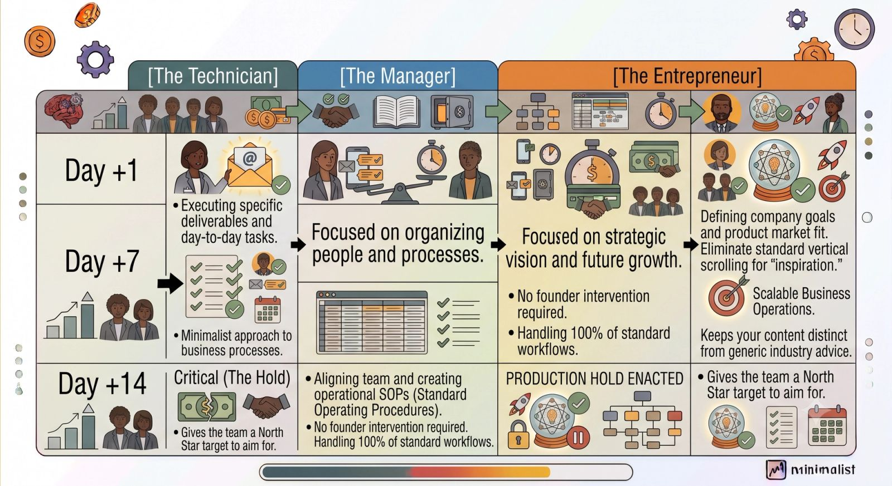
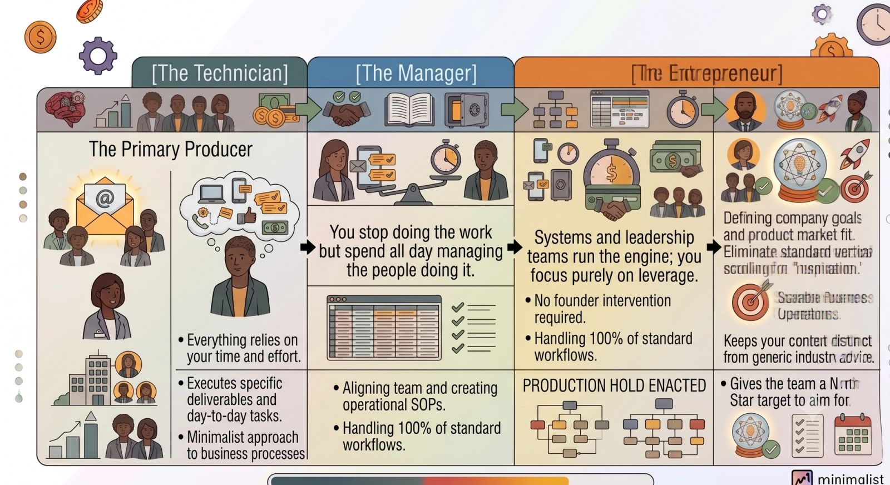

Most founders are addicted to the hustle. We take pride in putting out daily fires, answering emails at midnight, and being the ultimate problem-solvers in our companies.

But there is a brutal reality you eventually have to face: **If your business can’t survive a week without you, you don't own a business—you just own a demanding job.**

To transition from a frantic, hands-on operator to a strategic CEO, you have to completely reprogram how you think about scale, leadership, and systems. You don't need more hours in the day; you need better mental models.

If you are ready to step out of the weeds and build a company that runs on autopilot, add these three foundational business books to your weekend reading list.

### Book 1: *The E-Myth Revisited* by Michael E. Gerber

> **The Core Thesis:** Being great at a technical skill does not mean you know how to run a business that performs that skill.

Gerber breaks down the fatal assumption most founders make: because you understand the technical work of a business (like writing code, designing websites, or doing accounting), you understand how a business operates.

He introduces the concept of the **Technician, the Manager, and the Entrepreneur**—three conflicting personalities inside every founder's head. If you spend 100% of your time as the Technician doing the execution, your business will hit a hard ceiling.

- **The Key Takeaway:** You must shift your focus from working *in* your business to working *on* your business. Treat your company like a prototype for a franchise. Every process, task, and workflow needs to be so clearly documented that any capable person can step in and execute it perfectly without your intervention.

### Book 2: *Traction* by Gino Wickman

> **The Core Thesis:** You need an operational operating system to translate your high-level vision into weekly, measurable execution.

If *The E-Myth* gives you the philosophy of systems, *Traction* gives you the exact practical blueprints to build them. Wickman introduces the **Entrepreneurial Operating System (EOS)**, a set of six concrete components that turn chaotic startups into structured, predictable engines.

The book maps out everything you need to run a streamlined organization, including:

- **The Vision/牵引力 (V/TO):** A simple, 2-page tool to align your entire leadership team on long-term targets and core values.
- **The Accountability Chart:** Replacing the traditional org chart to clearly define who owns which business metrics.
- **The Level 10 Meeting:** A highly structured, weekly 90-minute meeting framework that eliminates aimless corporate rambling.
- **The Key Takeaway:** Growth requires an unsexy rhythm. By establishing clear Scorecards, tracking objective metrics, and holding your leadership team accountable to specific quarterly goals (called "Rocks"), you remove emotion from management and let data guide your operations.

### Book 3: *Scale* by Jeff Hoffman and David Finkel

> **The Core Thesis:** Scaling is about intentionally reducing your company's dependency on your personal production.

Written by a co-founder of Priceline (Hoffman) and a seasoned business coach (Finkel), *Scale* addresses the psychological hurdles of letting go. Many founders secretly love being the hero who saves the day, but that exact ego trap is what cripples the company's growth.

The authors break down how to map out your core business processes into what they call **"Level Three" systems**—fully independent workflows that run smoothly even when the founder is completely off the grid.

- **The Key Takeaway:** Your ultimate metric of success as a CEO is how much free time you have to focus on high-leverage strategic partnerships, product innovation, and market expansion. If your presence is required for the company to make money, you haven’t built a scalable asset.

### The Bottom Line

Building a self-sustaining company doesn't happen by accident. It requires a deliberate choice to stop being the bottleneck.

Pick up one of these books this weekend, put your phone on do-not-disturb, and start drafting the structural blueprints to reclaim your time, empower your remote team, and build a truly scalable enterprise.
