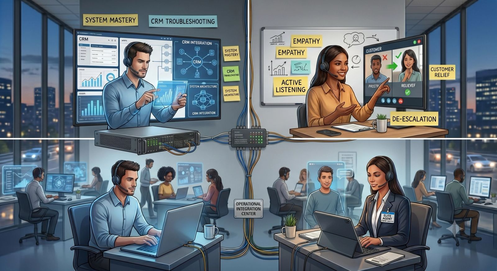

When most people think of a call center, they picture rows of people reading rigidly from scripts, ticking boxes, and watching the clock. But in today’s competitive landscape, exceptional customer service requires far more than just following a template. It demands a sophisticated blend of two distinct skill sets: **Technical Intelligence (IQ)** and **Emotional Intelligence (EQ)**.

At our agency, we believe that an outstanding customer experience happens at the intersection of these two disciplines. Here is an inside look at how we take raw talent and transform them into elite, empathetic support professionals.

## Part 1: Building the Brain (Technical Intelligence)

Emotional connection doesn't mean much if an agent can't actually solve the customer's problem. Our technical training program is intensive, continuous, and built to ensure absolute precision.

- **Deep-Dive System Architecture:** Our agents don't just learn how to navigate a CRM; they learn how data flows through it. Whether it's Salesforce, HubSpot, or a custom proprietary system, they understand how a ticket moves from creation to resolution.
- **The Art of Rapid Troubleshooting:** We train agents in root cause analysis. Instead of treating symptoms, they are taught to ask targeted, diagnostic questions that uncover the core technical or operational issue quickly, drastically reducing Average Handle Time (AHT).
- **Omnichannel Fluency:** A modern agent must be a chameleon. Our technical onboarding ensures agents can seamlessly transition from a live phone conversation to a fast-paced web chat or a formal email, adjusting their syntax and technical depth to fit the medium.

## Part 2: Nurturing the Heart (Emotional Intelligence)

A technically perfect answer delivered with a cold, robotic tone is still a bad customer experience. High EQ is what turns a standard transaction into a relationship. We screen for natural empathy during our hiring process, and then we ruthlessly polish it through target training.

**Active Listening vs. Waiting to Speak**

Most people listen to reply; our agents are trained to listen to *understand*. We teach them to pick up on micro-cues—sighs, pauses, and specific word choices—that signal a customer’s underlying frustration or anxiety. By mirroring the customer's pacing and validating their feelings early, agents de-escalate tension before it boils over.

**The Power of Reframing**

Language shapes reality. We banish standard call center phrases that trigger negative customer reactions and replace them with empowering alternatives:

- Instead of: *"That’s against our policy."*
- We teach: *"Here is what I can do to resolve this for you right now."*

**Tactical De-escalation**

When a customer is yelling, it is rarely about the agent; it is about the situation. Our EQ training modules include psychological profiling of stressed customers. Agents learn to view anger as a cry for help, allowing them to remain calm, objective, and supportive under high-pressure conditions.

## Part 3: The Integration – Simulating the Real World

The true test of an agent's training isn't a written exam—it’s a live, chaotic scenario. Before any agent takes a real customer interaction, they undergo rigorous simulation labs.

In our "Sandbox" environments, trainers play the role of highly technical, deeply frustrated, or incredibly confused users. Trainees must navigate complex database issues on their screens while simultaneously maintaining a warm, reassuring tone of voice. We record these sessions, analyze the audio and screen data, and provide granular, constructive feedback.

## The Ultimate Benefit to Your Business

Investing so heavily in both sides of the brain pays massive dividends for our clients. By training agents to marry technical execution with human empathy, we consistently deliver:

- **Higher First-Contact Resolution (FCR):** Agents resolve issues correctly the first time because they understand the tech *and* the customer's true intent.
- **Boosted Customer Retention:** Customers stay loyal to brands that make them feel heard, understood, and respected.
- **Lower Agent Burnout:** Equipping agents with high EQ gives them the emotional armor needed to handle difficult calls without absorbing the stress, leading to a happier, more stable workforce.

Behind every headset in our facility is a highly skilled professional who knows your systems inside and out—and knows exactly how to make your customers smile.
